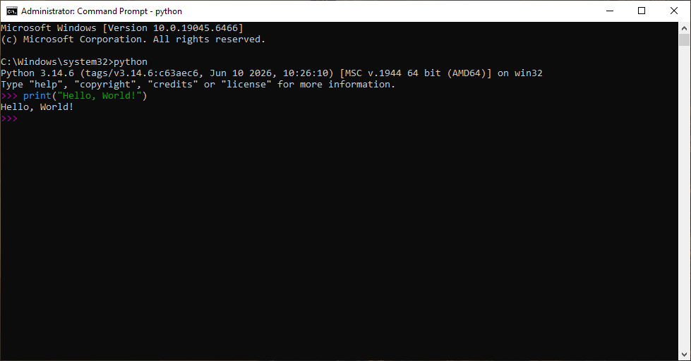

# Part 1 — Why Do We Need to Install Python?

🌐 Language: **English** | [فارسی](fa/README.md)

Before writing your first Python program, you need to prepare your computer.

But what exactly do we need to install?

Do we need Python?

Do we need an IDE?

Or do we need both?

Let's answer these questions first.

---

## What Is Python?

Python is a programming language.

Just like English is a language for communicating with people, Python is a language for communicating with computers.

However, computers do not understand Python directly.

They only understand machine language (binary).

So, something must translate our Python code into instructions that the computer can execute.

That is the job of the **Python Interpreter**.

---

## What Is the Python Interpreter?

The Python Interpreter is a program that reads your Python code and executes it.

For example, consider the following code:

```python
print("Hello, World!")
```

The interpreter reads this code, understands what it means, and tells the operating system to display the text on the screen.

Without the Python Interpreter, your computer would not know what this code means.

---

## How Does Python Execute Your Code?

The process is actually very simple:

```text
Your Python Code
        │
        ▼
Python Interpreter
        │
        ▼
Operating System
        │
        ▼
Program Output
```

Whenever you run a Python program, the interpreter acts as a bridge between your code and your computer.

---

## Interpreter vs IDE

Many beginners confuse these two terms.

They are not the same thing.

| Python Interpreter | IDE |
|--------------------|-----|
| Executes Python code | Helps you write Python code |
| Required | Optional |
| Runs your programs | Makes development easier |
| Example: Python | Examples: VS Code, PyCharm |

Think of it this way:

- The Interpreter is the **engine**.
- The IDE is the **workspace**.

You can write Python code without an IDE, but you cannot run Python code without the Python Interpreter.

---

## Do We Need an IDE?

Not yet.

For now, we only need to install Python itself.

In the next lessons, we will install and configure **Visual Studio Code**, one of the most popular code editors for Python development.

By learning one step at a time, you'll better understand how everything works.

---

## Part Summary

- Python is a programming language.
- Computers cannot understand Python directly.
- The Python Interpreter translates and executes Python code.
- An IDE is a tool that helps you write code.
- The Interpreter is required, while an IDE is optional.
- In the next part, we will download Python from the official website.

---

# Part 2 — Downloading Python

Now that you know what Python is and why you need it, it's time to download it.

Python is free and open-source, and it can be downloaded directly from its official website.

---

## Download Python from the Official Website

Open your web browser and visit the official Python website:

https://www.python.org

We strongly recommend downloading Python **only from the official website**.

This ensures that you always get:

- The latest stable version
- A secure installer
- Official updates
- Reliable documentation

---

## Choose the Latest Stable Version

In most cases, the website automatically detects your operating system and suggests the latest stable version of Python.

To download Python:

1. Open the **Downloads** menu.
2. Click the latest stable version of Python.

> **See Figure 1.**

<p align="center">
  
</p>

<p align="center">
  <em>Figure 1 — Download the latest stable version of Python from the official website.</em>
</p>

---

## If Your Operating System Is Not Detected

If the website does not automatically detect your operating system, simply open the **Downloads** menu and choose your operating system manually.

Python is available for:

- Windows
- macOS
- Linux

---

## Before You Continue

After the download is complete, do not run the installer yet.

In the next part, we will install Python step by step and configure it correctly.

---

## Part Summary

- Download Python only from the official website.
- Use the latest stable version of Python 3.
- The website usually detects your operating system automatically.
- In the next part, we will install Python on Windows.

---

# Part 3 — Installing Python on Windows

After downloading the Python installer, the next step is to install Python on your computer.

The installation process is straightforward, but there is one important option that you should not miss.

Let's install Python step by step.

---

## Run the Installer

Locate the installer you downloaded.

Its name will look similar to:

```text
python-3.x.x-amd64.exe
```

Double-click the installer to launch the Python Setup window.

---

## The Python Setup Window

When the installer opens, you will see the main setup window.

Two options are especially important.

> **See Figure 2.**

<p align="center">
  
</p>

<p align="center">
  <em>Figure 1 — The Python installer window.</em>
</p>

---

## Enable "Add Python to PATH"

Before installing Python, make sure the **Add Python to PATH** checkbox is enabled.

This allows Windows to recognize the `python` command from Command Prompt or PowerShell.

> ⚠️ **Important**
>
> Always check **Add Python to PATH** before clicking **Install Now**.

If you skip this step, Python may be installed correctly, but Windows might not recognize it from the command line.

---

## Click "Install Now"

Once the **Add Python to PATH** option is enabled, click **Install Now**.

The installer will copy all required files and configure Python automatically.

---

## Installing Python

The installation may take a few moments.

During this process, a progress bar will be displayed.

> **See Figure 3.**

<p align="center">
  
</p>

<p align="center">
  <em>Figure 1 — Python is being installed.</em>
</p>

---

## Installation Complete

When the installation finishes successfully, you will see the message:

```text
Setup was successful
```

Click **Close** to exit the installer.

> **See Figure 4.**

<p align="center">
  
</p>

<p align="center">
  <em>Figure 1 — Python has been installed successfully.</em>
</p>

---

> 💡 **Tip**
>
> Restart your Command Prompt or PowerShell after installing Python to ensure the PATH changes are applied.

---

## Part Summary

- Run the downloaded installer.
- Enable **Add Python to PATH**.
- Click **Install Now**.
- Wait until the installation is complete.
- Close the installer after the success message appears.

---

# Part 4 — Verifying the Installation

After installing Python, it's a good idea to verify that everything works correctly.

In this part, you'll check your Python installation and run Python for the first time.

---

## Open Command Prompt

Open the Windows Start Menu and search for:

```text
cmd
```

Then open **Command Prompt**.

> **See Figure 5.**

<p align="center">
  
</p>

<p align="center">
  <em>Figure 5 — Opening Command Prompt in Windows.</em>
</p>

---

## Check the Python Version

To verify that Python is installed correctly, type the following command:

```bash
python --version
```

Then press **Enter**.

If Python is installed correctly, you should see an output similar to:

```text
Python 3.14.6
```

> **See Figure 6.**

<p align="center">
  
</p>

<p align="center">
  <em>Figure 6 — Checking the installed Python version.</em>
</p>

---

> 💡 **Tip**
>
> Your version number may be different depending on when you installed Python.

---

## If the Command Doesn't Work

If you see a message similar to:

```text
'python' is not recognized as an internal or external command...
```

don't worry.

This usually happens because:

- Python was not added to the system PATH.
- Command Prompt was already open before Python was installed.

> ⚠️ **Important**
>
> Close Command Prompt and open it again before trying the command a second time.

If the problem still exists, reinstall Python and make sure **Add Python to PATH** is enabled.

---

## Start the Python Interpreter

Now type:

```bash
python
```

and press **Enter**.

If everything is working correctly, you'll see something similar to:

```text
Python 3.14.6 (...)
>>>
```

The `>>>` symbol means that Python is waiting for your commands.

> **See Figure 7.**

<p align="center">
  
</p>

<p align="center">
  <em>Figure 7 — The Python Interactive Shell.</em>
</p>

---

## Exit the Interpreter

To leave the Python Interpreter, type:

```python
exit()
```

and press **Enter**.

You can also use:

```text
Ctrl + Z
Enter
```

---

## Part Summary

- Opened Command Prompt.
- Verified the Python installation.
- Started the Python Interpreter.
- Learned how to exit the Interpreter.

---

# Part 5 — Your First Python Program

Congratulations!

Python is now installed and ready to use.

It's time to write and run your very first Python program.

---

## Open the Python Interpreter

Open **Command Prompt** and type:

```bash
python
```

Then press **Enter**.

If everything is working correctly, you'll see the Python Interactive Shell.

---

## Your First Program

Type the following command exactly as shown:

```python
print("Hello, World!")
```

Then press **Enter**.

Python immediately displays:

```text
Hello, World!
```

> **See Figure 8.**

<p align="center">
  
</p>

<p align="center">
  <em>Figure 8 — Running your first Python program.</em>
</p>

---

## Understanding the Code

Let's break it down.

```python
print("Hello, World!")
```

- `print()` is a built-in Python function.
- `"Hello, World!"` is a string.
- The `print()` function displays the string on the screen.

This is your first Python program.

---

## Try It Yourself

Now experiment with your own text.

For example:

```python
print("My name is Ahmad.")
```

or

```python
print("I am learning Python!")
```

Feel free to replace the text with anything you like.

---

> 💡 **Tip**
>
> Programming is learned by practicing.
> Try changing the text several times and observe the output.

---

## Why "Hello, World!"?

The **Hello, World!** program has been used for decades as the traditional first program in many programming languages.

Its purpose is simple:

It verifies that your programming environment is working correctly while introducing the basic syntax of the language.

---

## Lesson Summary

Congratulations!

In this lesson, you learned how to:

- Download Python.
- Install Python on Windows.
- Verify the installation.
- Open the Python Interpreter.
- Run your very first Python program.

You now have a fully working Python environment.

In the next lesson, you'll install **Visual Studio Code** and begin writing Python programs in real `.py` files.

---