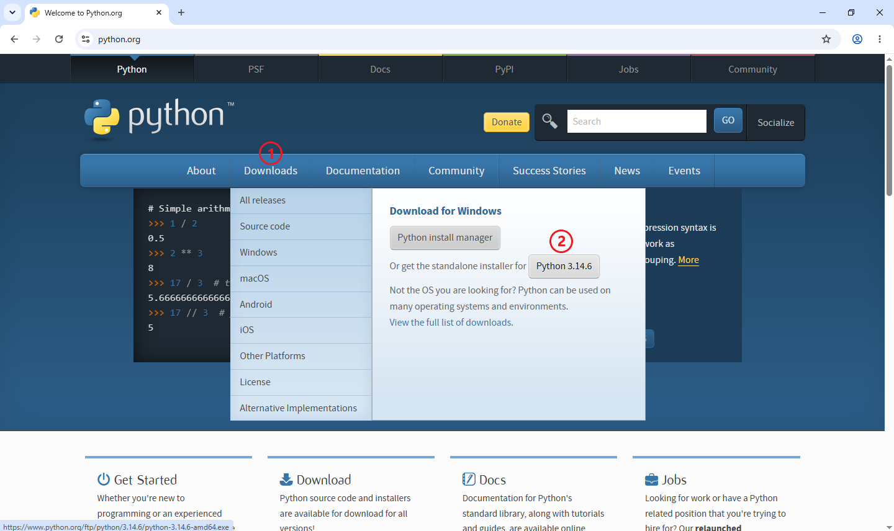
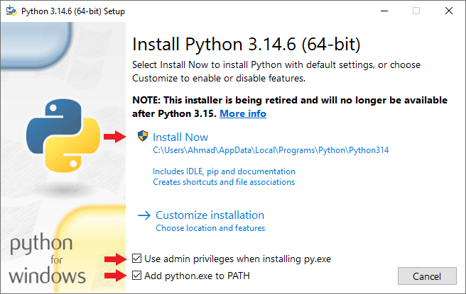
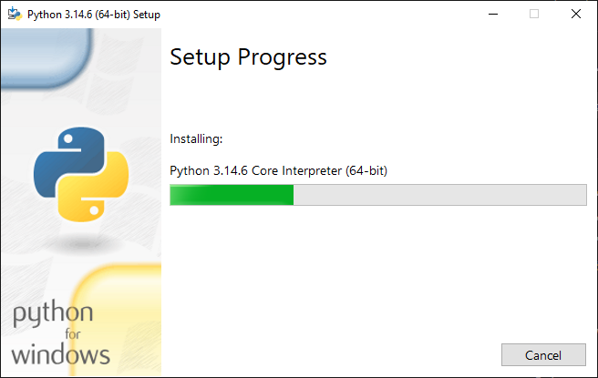
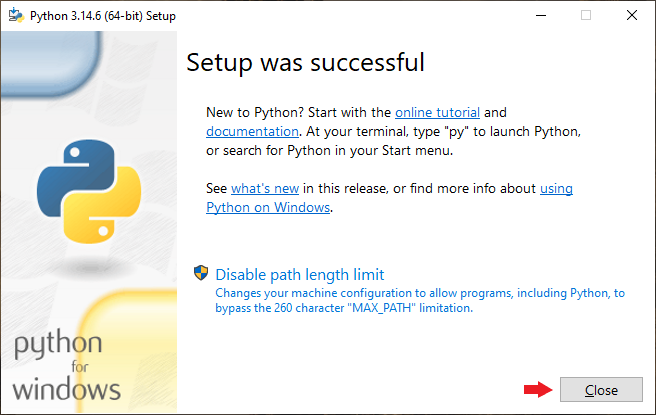
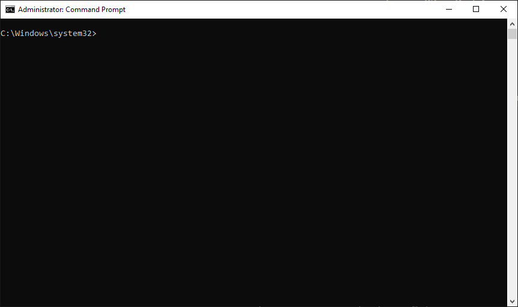
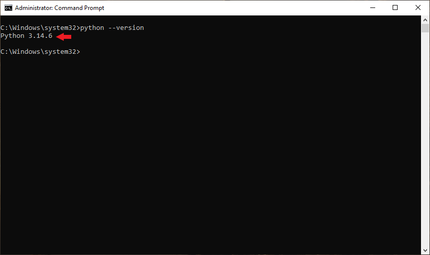
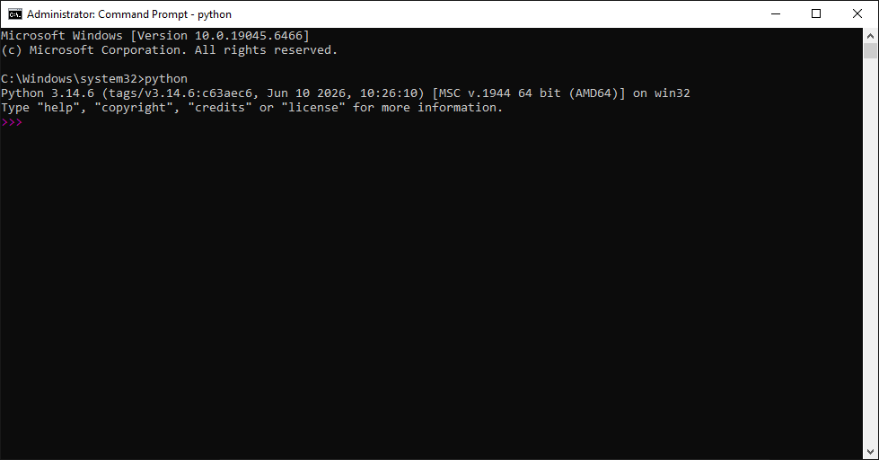

# بخش ۱ — چرا باید پایتون را نصب کنیم؟

🌐 Language: **فارسی** | [English](../README.md)

قبل از اینکه اولین برنامه پایتون خود را بنویسیم، ابتدا باید کامپیوتر خود را آماده کنیم.

اما دقیقاً چه چیزی را باید نصب کنیم؟

آیا فقط به پایتون نیاز داریم؟

آیا باید یک محیط برنامه‌ نویسی (IDE) نصب کنیم؟

یا هر دو؟

قبل از شروع نصب، بهتر است پاسخ این سؤال‌ها را بدانیم.

---

## پایتون چیست؟

پایتون یک زبان برنامه ‌نویسی است.

همان‌ طور که زبان فارسی یا انگلیسی برای ارتباط بین انسان‌ها استفاده می‌شود، پایتون نیز زبانی برای ارتباط با کامپیوتر است.

اما کامپیوترها زبان پایتون را به‌صورت مستقیم متوجه نمی‌شوند.

آن‌ها فقط زبان ماشین (Machine Language) یا همان کدهای دودویی را درک می‌کنند.

بنابراین، به برنامه‌ای نیاز داریم که کدهای پایتون را به زبانی تبدیل کند که کامپیوتر بتواند آن را اجرا کند.

این وظیفه بر عهده **مفسر پایتون (Python Interpreter)** است.

---

## مفسر پایتون (Python Interpreter) چیست؟

مفسر پایتون برنامه‌ای است که کدهای نوشته‌شده با پایتون را می‌خواند و اجرا می‌کند.

برای مثال، کد زیر را در نظر بگیرید:

```python
print("Hello, World!")
```

مفسر این کد را می‌ خواند، معنی آن را درک می‌ کند و به سیستم‌ عامل دستور می‌ دهد عبارت **Hello, World!** را روی صفحه نمایش دهد.

اگر مفسر پایتون روی سیستم شما نصب نباشد، کامپیوتر نمی‌ تواند این کد را اجرا کند.

---

## کدهای پایتون چگونه اجرا می‌شوند؟

فرآیند اجرای یک برنامه پایتون بسیار ساده است:

```text
کد پایتون شما
      │
      ▼
مفسر پایتون
      │
      ▼
سیستم‌ عامل
      │
      ▼
خروجی برنامه
```

هر بار که یک برنامه پایتون را اجرا می‌ کنید، مفسر نقش واسطه بین کد شما و کامپیوتر را بر عهده دارد.

---

## تفاوت مفسر (Interpreter) و محیط توسعه (IDE)

بسیاری از افراد مبتدی این دو مفهوم را با یکد یگر اشتباه می‌ گیرند.

در حالی که وظیفه آن‌ها کاملاً متفاوت است.

| مفسر پایتون | محیط توسعه (IDE) |
|-------------|------------------|
| کدهای پایتون را اجرا می‌ کند. | به شما در نوشتن کد کمک می‌کند. |
| وجود آن ضروری است. | وجود آن اختیاری است. |
| برنامه‌ ها را اجرا می‌ کند. | فرآیند برنامه‌ نویسی را آسان‌ تر می‌ کند. |
| مثال: Python | مثال: VS Code، PyCharm |

به بیان ساده:

- **مفسر، موتور اجرای برنامه است.**
- **محیط توسعه، فضای کار برنامه‌ نویس است.**

بدون مفسر، اجرای برنامه‌ های پایتون امکان‌ پذیر نیست؛ اما می‌ توانید حتی بدون IDE نیز برنامه‌ های پایتون بنویسید.

---

## آیا در حال حاضر به IDE نیاز داریم؟

خیر.

در این مرحله فقط کافی است خود **Python** را نصب کنیم.

در درس‌ های بعدی، محیط برنامه‌ نویسی **Visual Studio Code** را نیز نصب و پیکر بندی خواهیم کرد.

یادگیری مرحله‌ به‌ مرحله باعث می‌شود درک بهتری از ابزارهای مورد استفاده داشته باشید.

---

## خلاصه این بخش

- پایتون یک زبان برنامه‌ نویسی است.
- کامپیوترها زبان پایتون را مستقیماً درک نمی‌ کنند.
- مفسر پایتون وظیفه اجرای کدهای پایتون را بر عهده دارد.
- IDE محیطی برای نوشتن کد است.
- وجود مفسر ضروری است، اما استفاده از IDE اختیاری است.
- در بخش بعد، پایتون را از وب‌ سایت رسمی آن دانلود خواهیم کرد.

---

# بخش ۲ — دانلود پایتون

حالا که می‌دانید پایتون چیست و چرا به آن نیاز داریم، وقت آن رسیده است که آن را دانلود کنیم.

پایتون یک نرم‌افزار **رایگان و متن‌باز (Open Source)** است و می‌توانید آن را مستقیماً از وب ‌سایت رسمی آن دریافت کنید.

---

## دانلود پایتون از وب‌ سایت رسمی

مرورگر خود را باز کنید و وارد وب‌سایت رسمی پایتون شوید:

https://www.python.org

توصیه می‌شود **همیشه** پایتون را فقط از وب‌سایت رسمی آن دانلود کنید.

با این کار:

- آخرین نسخه پایدار را دریافت می‌ کنید.
- فایل نصب کاملاً امن و معتبر خواهد بود.
- به‌ روزرسانی‌ های رسمی را دریافت می‌ کنید.
- به مستندات رسمی دسترسی خواهید داشت.

---

## آخرین نسخه پایدار را انتخاب کنید

در بیشتر مواقع، وب‌ سایت به‌ صورت خودکار سیستم‌ عامل شما را تشخیص می‌ دهد و آخرین نسخه پایدار پایتون را پیشنهاد می‌ کند.

برای دانلود:

1. منوی **Downloads** را باز کنید.
2. روی آخرین نسخه پایدار پایتون کلیک کنید.

> **به شکل ۱ مراجعه کنید.**

<p align="center">
  
</p>

<p align="center">
  <em>شکل ۱ — دانلود آخرین نسخه پایدار پایتون از وب‌ سایت رسمی.</em>
</p>

---

## اگر سیستم‌عامل شما به‌ صورت خودکار تشخیص داده نشد

اگر وب‌ سایت سیستم‌ عامل شما را به‌ صورت خودکار تشخیص نداد، کافی است از منوی **Downloads** سیستم‌ عامل خود را انتخاب کنید.

پایتون برای سیستم‌ عامل‌ های زیر منتشر می‌شود:

- Windows
- macOS
- Linux

---

## قبل از ادامه

بعد از پایان دانلود، هنوز فایل نصب را اجرا نکنید.

در بخش بعد، نصب پایتون را مرحله ‌به‌ مرحله انجام خواهیم داد و تنظیمات مهم آن را نیز بررسی می‌کنیم.

---

## خلاصه این بخش

- پایتون را فقط از وب‌ سایت رسمی دانلود کنید.
- آخرین نسخه پایدار Python 3 را انتخاب کنید.
- معمولاً وب‌ سایت سیستم‌ عامل شما را به‌ صورت خودکار تشخیص می‌ دهد.
- در بخش بعد، نصب پایتون را آغاز خواهیم کرد.

---

# بخش ۳ — نصب پایتون در ویندوز

بعد از دانلود فایل نصب، نوبت به نصب پایتون روی کامپیوتر می‌ رسد.

فرآیند نصب بسیار ساده است، اما یک گزینه مهم وجود دارد که نباید آن را فراموش کنید.

در ادامه، نصب پایتون را مرحله‌ به‌ مرحله انجام می ‌دهیم.

---

## اجرای فایل نصب

فایل نصب دانلود شده را پیدا کنید.

نام آن معمولاً مشابه نمونه زیر است:

```text
python-3.x.x-amd64.exe
```

روی فایل دو بار کلیک کنید تا پنجره نصب پایتون باز شود.

---

## پنجره نصب پایتون

پس از اجرای فایل، پنجره اصلی نصب نمایش داده می‌شود.

در این پنجره دو بخش اهمیت ویژه‌ ای دارند.

> **به شکل ۲ مراجعه کنید.**

<p align="center">
  
</p>

<p align="center">
  <em>شکل ۲ — پنجره نصب پایتون.</em>
</p>

---

## فعال کردن گزینه "Add Python to PATH"

قبل از شروع نصب، مطمئن شوید گزینه **Add Python to PATH** فعال شده است.

این گزینه باعث می‌ شود ویندوز بتواند دستور `python` را در **Command Prompt** یا **PowerShell** شناسایی کند.

> ⚠️ **مهم**
>
> قبل از کلیک روی **Install Now**، حتماً گزینه **Add Python to PATH** را فعال کنید.

اگر این گزینه را فعال نکنید، ممکن است پایتون به‌ درستی نصب شود، اما ویندوز نتواند آن را از طریق خط فرمان اجرا کند.

---

## کلیک روی "Install Now"

پس از فعال کردن گزینه **Add Python to PATH**، روی دکمه **Install Now** کلیک کنید.

در این مرحله، فایل‌ های مورد نیاز کپی شده و پایتون به‌ صورت خودکار روی سیستم نصب می‌شود.

---

## در حال نصب

فرآیند نصب ممکن است چند لحظه طول بکشد.

در این مدت، نوار پیشرفت نصب نمایش داده می‌ شود.

> **به شکل ۳ مراجعه کنید.**

<p align="center">
  
</p>

<p align="center">
  <em>شکل ۳ — نصب پایتون در حال انجام است.</em>
</p>

---

## پایان نصب

پس از پایان موفقیت‌ آمیز نصب، پیام زیر نمایش داده می‌شود:

```text
Setup was successful
```

روی دکمه **Close** کلیک کنید تا پنجره نصب بسته شود.

> **به شکل ۴ مراجعه کنید.**

<p align="center">
  
</p>

<p align="center">
  <em>شکل ۴ — نصب پایتون با موفقیت به پایان رسید.</em>
</p>

---

> 💡 **نکته کاربردی**
>
> پس از نصب، یک‌بار Command Prompt یا PowerShell را ببندید و دوباره باز کنید تا تغییرات مربوط به PATH اعمال شوند.

---

## خلاصه این بخش

- فایل نصب را اجرا کردید.
- گزینه **Add Python to PATH** را فعال کردید.
- روی **Install Now** کلیک کردید.
- منتظر پایان نصب ماندید.
- پس از مشاهده پیام موفقیت، پنجره نصب را بستید.

---

# بخش ۴ — بررسی نصب پایتون

بعد از نصب پایتون، بهتر است مطمئن شوید که همه‌چیز به‌درستی کار می‌کند.

در این بخش، نصب پایتون را بررسی کرده و برای اولین بار آن را اجرا خواهیم کرد.

---

## باز کردن Command Prompt

منوی Start ویندوز را باز کنید و عبارت زیر را جستجو کنید:

```text
cmd
```

سپس برنامه **Command Prompt** را اجرا کنید.

> **به شکل ۵ مراجعه کنید.**

p align="center">
  
</p>

<p align="center">
  <em>شکل ۵ — باز کردن Command Prompt در ویندوز.</em>
</p>

---

## بررسی نسخه پایتون

برای اطمینان از نصب صحیح پایتون، دستور زیر را وارد کنید:

```bash
python --version
```

سپس کلید **Enter** را فشار دهید.

اگر نصب با موفقیت انجام شده باشد، خروجی مشابه زیر را مشاهده خواهید کرد:

```text
Python 3.14.6
```

> **به شکل ۶ مراجعه کنید.**

p align="center">
  
</p>

<p align="center">
  <em>شکل ۶ — بررسی نسخه نصب‌شده پایتون.</em>
</p>

---

> 💡 **نکته کاربردی**
>
> ممکن است شماره نسخه‌ای که مشاهده می‌کنید با این مثال متفاوت باشد؛ این موضوع کاملاً طبیعی است.

---

## اگر دستور اجرا نشد

اگر با پیامی مشابه زیر روبه‌رو شدید:

```text
'python' is not recognized as an internal or external command...
```

نگران نباشید.

این مشکل معمولاً به یکی از دلایل زیر رخ می‌دهد:

- هنگام نصب، گزینه **Add Python to PATH** فعال نشده است.
- Command Prompt قبل از نصب پایتون باز بوده و باید یک‌بار بسته و دوباره اجرا شود.

> ⚠️ **مهم**
>
> قبل از امتحان دوباره دستور، Command Prompt را ببندید و مجدداً باز کنید.

اگر مشکل همچنان ادامه داشت، پایتون را دوباره نصب کنید و مطمئن شوید گزینه **Add Python to PATH** فعال است.

---

## اجرای مفسر پایتون

اکنون دستور زیر را وارد کنید:

```bash
python
```

و کلید **Enter** را فشار دهید.

اگر همه‌چیز درست باشد، خروجی مشابه زیر را مشاهده خواهید کرد:

```text
Python 3.14.6 (...)
>>>
```

علامت `>>>` نشان می‌دهد که وارد محیط تعاملی (Interactive Shell) پایتون شده‌اید و آماده اجرای دستورات هستید.

> **به شکل ۷ مراجعه کنید.**

p align="center">
  
</p>

<p align="center">
  <em>شکل ۷ — محیط تعاملی پایتون (Python Interactive Shell).</em>
</p>

---

## خروج از محیط پایتون

برای خروج از محیط تعاملی، دستور زیر را وارد کنید:

```python
exit()
```

سپس **Enter** را فشار دهید.

همچنین می‌توانید از روش زیر استفاده کنید:

```text
Ctrl + Z
Enter
```

---

## خلاصه این بخش

- Command Prompt را باز کردید.
- نصب پایتون را بررسی کردید.
- وارد محیط تعاملی پایتون شدید.
- روش خروج از محیط تعاملی را یاد گرفتید.

---