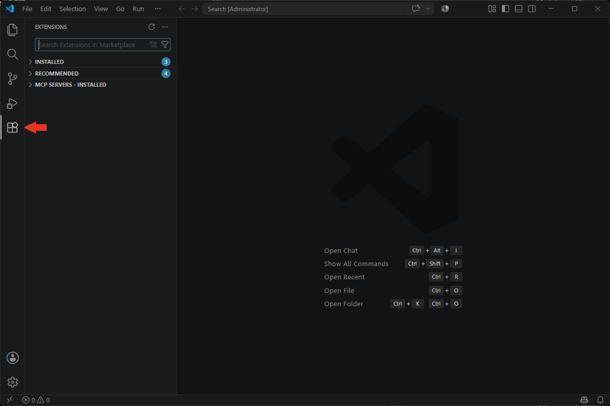
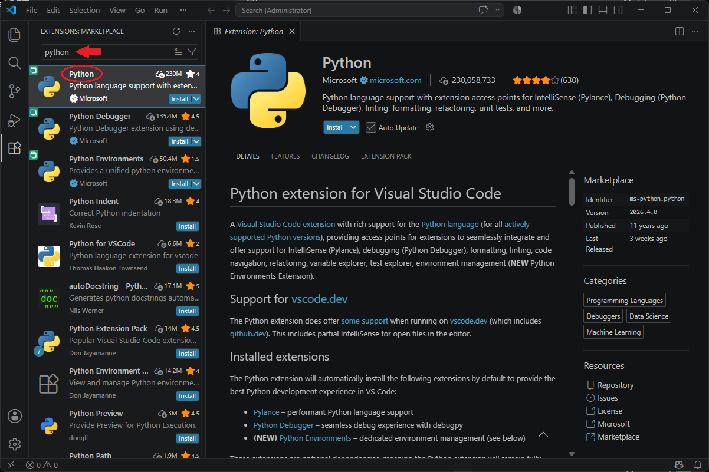
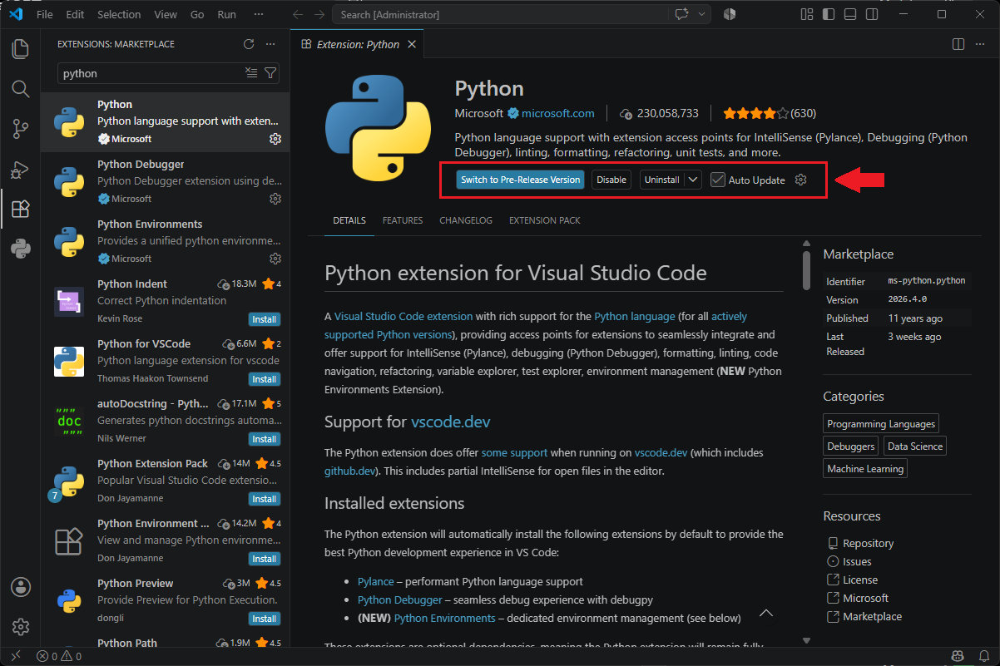
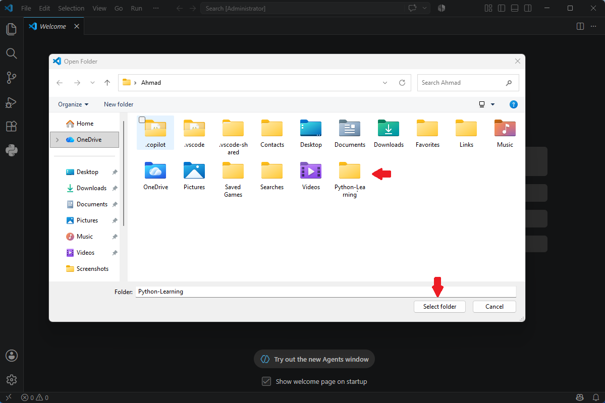
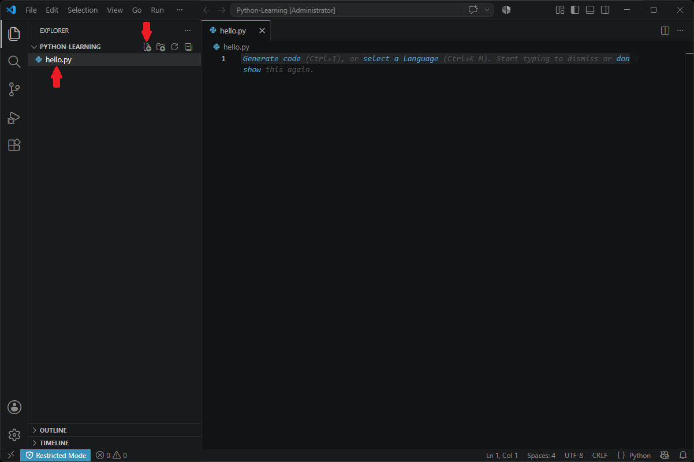
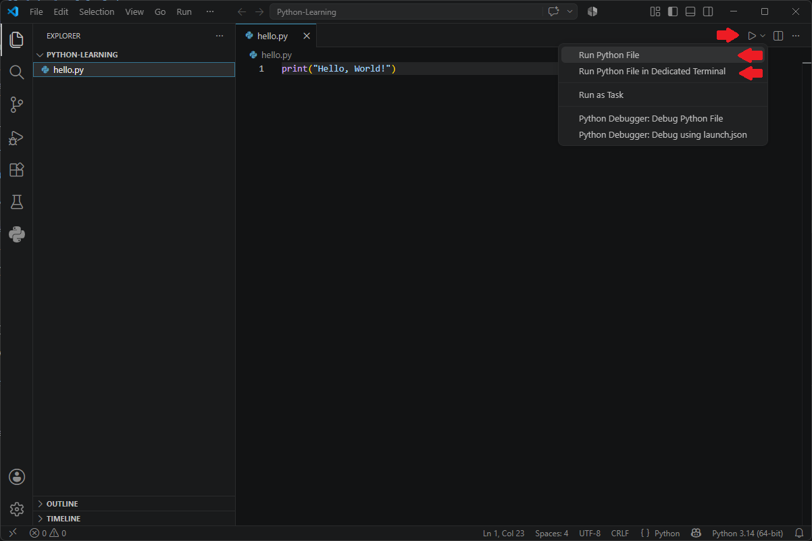
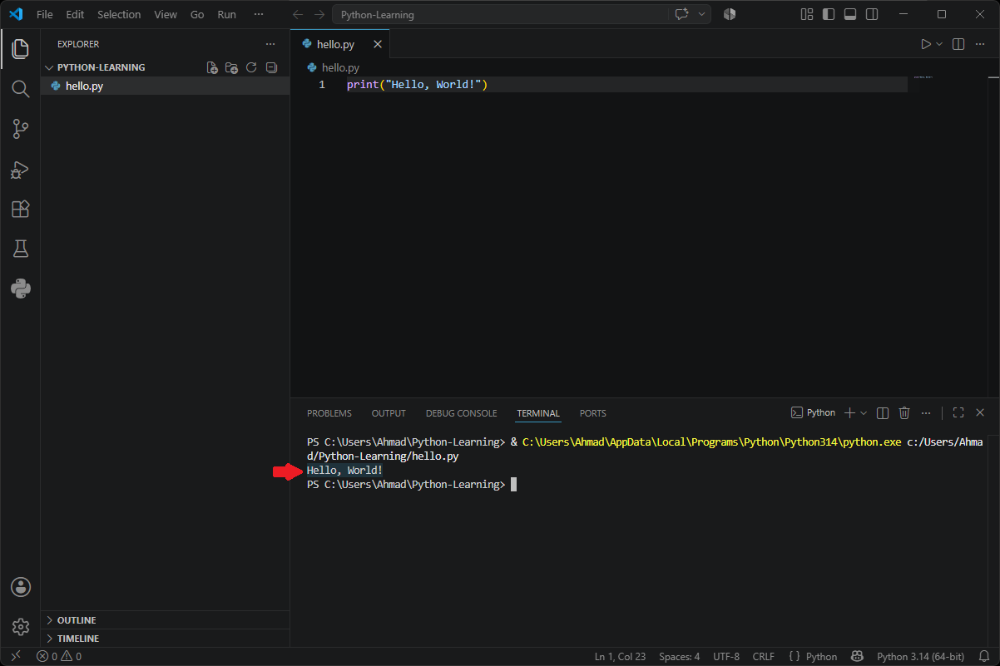

# بخش ۱ — Visual Studio Code چیست؟

🌐 Language: **فارسی** | [English](../README.md)

در درس قبل، پایتون را روی سیستم خود نصب کردید.

حالا به محیطی نیاز دارید که بتوانید برنامه‌های پایتون را در آن بنویسید، ویرایش کنید و مدیریت کنید.

اینجاست که **Visual Studio Code** یا به اختصار **VS Code** وارد می‌شود.

---

## VS Code چیست؟

Visual Studio Code یک ویرایشگر کد رایگان است که توسط شرکت Microsoft توسعه داده شده است.

این نرم‌افزار به شما کمک می‌کند کدهای خود را راحت‌تر بنویسید، ویرایش کنید، مدیریت کنید و اجرا کنید.

برخلاف مفسر پایتون، VS Code برای اجرای پایتون ضروری نیست.

بلکه محیطی مناسب و حرفه‌ای برای برنامه‌نویسی در اختیار شما قرار می‌دهد.

---

## چرا از VS Code استفاده می‌کنیم؟

VS Code یکی از محبوب‌ترین ویرایشگرهای کدنویسی در جهان است، زیرا:

- رایگان است.
- سبک و سریع است.
- روی Windows، macOS و Linux اجرا می‌شود.
- قابلیت شخصی‌سازی بالایی دارد.
- از صدها زبان برنامه‌نویسی پشتیبانی می‌کند.

همچنین هزاران افزونه (Extension) برای آن وجود دارد که امکانات بیشتری در اختیار شما قرار می‌دهند.

---

## تفاوت VS Code و Python

بسیاری از افراد مبتدی تصور می‌کنند VS Code همان پایتون است.

درحالی‌که این دو نقش‌های متفاوتی دارند.

| Python | Visual Studio Code |
|---------|--------------------|
| زبان برنامه‌نویسی | ویرایشگر کد |
| برنامه‌ها را اجرا می‌کند | به نوشتن برنامه کمک می‌کند |
| ضروری است | اختیاری است |

<br />
پایتون موتور اجرای برنامه است.

VS Code محیط کاری برنامه‌نویس است.

---

## چرا در این کتاب از VS Code استفاده می‌کنیم؟

از این درس به بعد، تمام مثال‌ها و تمرین‌های کتاب در Visual Studio Code انجام خواهند شد.

استفاده از یک محیط ثابت، یادگیری را ساده‌تر و منظم‌تر می‌کند.

---

## خلاصه این بخش

- VS Code یک ویرایشگر کد رایگان است.
- توسط Microsoft توسعه داده شده است.
- به نوشتن و مدیریت کد کمک می‌کند.
- VS Code خودِ پایتون نیست.
- در بخش بعد، VS Code را از وب‌سایت رسمی دانلود خواهیم کرد.

# بخش ۲ — دانلود Visual Studio Code

حالا که با Visual Studio Code آشنا شدید، وقت آن رسیده است که آن را دانلود کنید.

VS Code یک نرم‌افزار رایگان است و می‌توانید آن را مستقیماً از وب‌سایت رسمی Microsoft دریافت کنید.

---

## دانلود از وب‌سایت رسمی

مرورگر خود را باز کنید و وارد آدرس زیر شوید:

https://code.visualstudio.com

همیشه Visual Studio Code را از وب‌سایت رسمی Microsoft دانلود کنید.

با این کار:

- آخرین نسخه پایدار را دریافت می‌کنید.
- به‌روزرسانی‌های رسمی را دریافت خواهید کرد.
- فایل نصب کاملاً معتبر و امن خواهد بود.
- نسخه مناسب سیستم‌عامل شما دانلود می‌شود.

---

## دانلود نسخه مناسب سیستم‌عامل

وب‌سایت VS Code معمولاً سیستم‌عامل شما را به‌صورت خودکار تشخیص می‌دهد.

در بیشتر مواقع، یک دکمه بزرگ دانلود متناسب با سیستم شما نمایش داده می‌شود.

روی آن کلیک کنید تا دانلود آغاز شود.

> **به شکل ۱ مراجعه کنید.**

<p align="center">
  
</p>

<p align="center">
  <em>شکل ۱ — دانلود Visual Studio Code از وب‌سایت رسمی Microsoft.</em>
</p>

---

## سیستم‌عامل‌های پشتیبانی‌شده

Visual Studio Code برای سیستم‌عامل‌های زیر منتشر می‌شود:

- Windows
- macOS
- Linux

اگر نسخه مناسب سیستم شما به‌صورت خودکار نمایش داده نشد، می‌توانید آن را به‌صورت دستی از صفحه دانلود انتخاب کنید.

---

> 💡 **نکته کاربردی**
>
> مگر اینکه دلیل خاصی داشته باشید، همیشه نسخه **Stable** را دانلود کنید و از نسخه **Insiders** استفاده نکنید.

---

## قبل از ادامه

بعد از پایان دانلود، هنوز فایل نصب را اجرا نکنید.

در بخش بعد، نصب Visual Studio Code را مرحله‌به‌مرحله انجام خواهیم داد.

---

## خلاصه این بخش

- VS Code را فقط از وب‌سایت رسمی Microsoft دانلود کنید.
- وب‌سایت معمولاً سیستم‌عامل شما را به‌صورت خودکار تشخیص می‌دهد.
- نسخه Stable را دانلود کنید.
- در بخش بعد، VS Code را نصب خواهیم کرد.

# بخش ۳ — نصب Visual Studio Code

بعد از دانلود Visual Studio Code، نوبت به نصب آن می‌رسد.

فرآیند نصب ساده است و معمولاً فقط چند دقیقه زمان می‌برد.

---

## اجرای فایل نصب

فایل نصب دانلودشده را پیدا کنید.

نام آن معمولاً مشابه نمونه زیر است:

```text
VSCodeUserSetup-x64-1.xx.x.exe
```

روی فایل دوبار کلیک کنید تا نصب آغاز شود.

---

## پذیرش توافق‌نامه

متن توافق‌نامه را مطالعه کنید.

گزینه زیر را انتخاب کنید:

```text
I accept the agreement
```

سپس روی **Next** کلیک کنید.

> **به شکل ۲ مراجعه کنید.**

<p align="center">
  
</p>

<p align="center">
  <em>شکل ۲ — پذیرش توافق‌نامه نصب.</em>
</p>

---

## انتخاب محل نصب

برای اکثر کاربران، محل نصب پیش‌فرض مناسب است.

بدون تغییر تنظیمات، روی **Next** کلیک کنید.

> 💡 **نکته کاربردی**
>
> مگر اینکه دلیل خاصی داشته باشید، مسیر پیش‌فرض نصب را تغییر ندهید.

---

## انتخاب گزینه‌های اضافی

در این مرحله، نصب‌کننده چند گزینه اختیاری نمایش می‌دهد.

توصیه می‌شود گزینه‌های زیر را فعال کنید:

- ✔ ایجاد میانبر روی Desktop
- ✔ اضافه کردن **Open with Code** برای فایل‌ها
- ✔ اضافه کردن **Open with Code** برای پوشه‌ها
- ✔ ثبت VS Code به‌عنوان ویرایشگر فایل‌های پشتیبانی‌شده
- ✔ اضافه کردن VS Code به PATH

> **به شکل ۳ مراجعه کنید.**

<p align="center">
  
</p>

<p align="center">
  <em>شکل ۳ — گزینه‌های پیشنهادی هنگام نصب.</em>
</p>

---

> ⚠️ **مهم**
>
> مطمئن شوید گزینه **Add to PATH** فعال باشد تا بتوانید VS Code را از طریق خط فرمان نیز اجرا کنید.

---

## نصب Visual Studio Code

روی دکمه **Install** کلیک کنید.

منتظر بمانید تا نوار پیشرفت نصب کامل شود.

> **به شکل ۴ مراجعه کنید.**

<p align="center">
  
</p>

<p align="center">
  <em>شکل ۴ — نصب Visual Studio Code.</em>
</p>

---

## پایان نصب

پس از پایان نصب، روی **Finish** کلیک کنید.

گزینه **Launch Visual Studio Code** را فعال نگه دارید تا VS Code پس از پایان نصب به‌صورت خودکار اجرا شود.

> **به شکل ۵ مراجعه کنید.**

<p align="center">
  
</p>

<p align="center">
  <em>شکل ۵ — نصب Visual Studio Code با موفقیت به پایان رسید.</em>
</p>

---

## خلاصه این بخش

- فایل نصب را اجرا کردید.
- توافق‌نامه را پذیرفتید.
- تنظیمات پیش‌فرض را حفظ کردید.
- گزینه‌های پیشنهادی را فعال کردید.
- Visual Studio Code را با موفقیت نصب کردید.

---

# بخش ۴ — نصب افزونه Python

Visual Studio Code از طریق افزونه‌ها از زبان‌های برنامه‌نویسی مختلف پشتیبانی می‌کند.

برای نوشتن و اجرای برنامه‌های پایتون، ابتدا باید افزونه رسمی Python را نصب کنید.

---

## باز کردن بخش Extensions

بر نامه ی Visual Studio Code را اجرا کنید.

از نوار کناری سمت چپ، روی آیکون **Extensions** کلیک کنید.

همچنین می‌توانید با میانبر زیر این بخش را باز کنید:

```text
Ctrl + Shift + X
```

> **به شکل ۶ مراجعه کنید.**

<p align="center">
  
</p>

<p align="center">
  <em>شکل ۶ — باز کردن بخش Extensions.</em>
</p>

---

## جستجوی افزونه Python

در کادر جستجو عبارت زیر را وارد کنید:

```text
Python
```

اولین نتیجه باید افزونه رسمی **Python** باشد که توسط **Microsoft** منتشر شده است.

> **به شکل ۷ مراجعه کنید.**

<p align="center">
  
</p>

<p align="center">
  <em>شکل ۷ — جستجوی افزونه رسمی Python.</em>
</p>

---

> ⚠️ **مهم**
>
> حتماً افزونه **Python** منتشرشده توسط **Microsoft** را نصب کنید و از نصب افزونه‌های مشابه که توسط ناشران دیگر منتشر شده‌اند خودداری کنید.

---

## نصب افزونه

روی دکمه **Install** کلیک کنید.

نرم افزار VS Code افزونه را دانلود و به‌صورت خودکار نصب می‌کند.

این فرآیند معمولاً فقط چند ثانیه طول می‌کشد.

---

## بررسی نصب

پس از پایان نصب، دکمه **Install** به **Uninstall** (یا **Disable**) تغییر می‌کند.

این یعنی افزونه با موفقیت نصب شده است.

> **به شکل ۸ مراجعه کنید.**

<p align="center">
  
</p>

<p align="center">
  <em>شکل ۸ — نصب موفق افزونه Python.</em>
</p>

---

> 💡 **نکته کاربردی**
>
> افزونه Python را همیشه به‌روز نگه دارید تا از جدیدترین امکانات و رفع اشکالات بهره‌مند شوید.

---

## خلاصه این بخش

- بخش Extensions را باز کردید.
- افزونه رسمی Python را جستجو کردید.
- افزونه را نصب کردید.
- از نصب موفق آن اطمینان حاصل کردید.

در بخش بعد، اولین فایل پایتون خود را در Visual Studio Code ایجاد و باز خواهید کرد.

---

# بخش ۵ — ایجاد اولین فایل پایتون

تا اینجا از محیط تعاملی پایتون (Python Interactive Shell) استفاده کردید.

اکنون زمان آن رسیده است که کدهای خود را داخل یک فایل واقعی بنویسید.

تمام پروژه‌های حرفه‌ای پایتون به همین روش توسعه داده می‌شوند.

---

## ایجاد پوشه پروژه

قبل از نوشتن کد، بهتر است یک پوشه برای پروژه خود ایجاد کنید.

برای مثال:

```text
Python-Learning
```

سپس این پوشه را در Visual Studio Code باز کنید.

از مسیر زیر استفاده کنید:

**File → Open Folder...**

و پوشه پروژه را انتخاب کنید.

> **به شکل ۹ مراجعه کنید.**

<p align="center">
  
</p>

<p align="center">
  <em>شکل ۹ — باز کردن پوشه پروژه در Visual Studio Code.</em>
</p>

---

## ایجاد اولین فایل پایتون

در بخش Explorer روی **New File** کلیک کنید.

نام فایل را به صورت زیر وارد کنید:

```text
hello.py
```

دقت کنید که پسوند فایل باید **.py** باشد.

> **به شکل ۱۰ مراجعه کنید.**

<p align="center">
  
</p>

<p align="center">
  <em>شکل ۱۰ — ایجاد اولین فایل پایتون.</em>
</p>

---

> ⚠️ **مهم**
>
> فایل‌های پایتون را همیشه با پسوند **.py** ذخیره کنید.

---

## نوشتن اولین برنامه

کد زیر را داخل فایل بنویسید:

```python
print("Hello, World!")
```

سپس فایل را با میانبر زیر ذخیره کنید:

```text
Ctrl + S
```

---

## تفاوت فایل با محیط تعاملی

این بار کد شما داخل یک فایل ذخیره شده است.

به همین دلیل می‌توانید:

- بعداً دوباره آن را اجرا کنید.
- آن را ویرایش کنید.
- برای دیگران ارسال کنید.
- پروژه‌های بزرگ‌تر ایجاد کنید.

تمام برنامه‌های واقعی پایتون به همین روش نوشته می‌شوند.

---

> 💡 **نکته کاربردی**
>
> همیشه برای فایل‌های خود از نام‌های واضح و مرتبط استفاده کنید؛ مانند:
>
> - `calculator.py`
> - `game.py`
> - `weather.py`

---

## خلاصه این بخش

- یک پوشه پروژه ایجاد کردید.
- پوشه را در VS Code باز کردید.
- اولین فایل پایتون را ساختید.
- اولین برنامه را داخل فایل نوشتید.
- فایل را ذخیره کردید.

در بخش بعد، این فایل را برای اولین بار اجرا خواهید کرد.

---

# بخش ۶ — اجرای اولین فایل پایتون

فایل پایتون شما آماده است.

حالا وقت آن رسیده است که آن را اجرا کنید.

---

## باز کردن فایل پایتون

فایلی را که در بخش قبل ایجاد کردید باز کنید.

برای مثال:

```text
hello.py
```

قبل از اجرا، مطمئن شوید فایل را ذخیره کرده‌اید.

---

## اجرای برنامه

روی دکمه **Run Python File** در گوشه بالا سمت راست Visual Studio Code کلیک کنید.

همچنین می‌توانید داخل ویرایشگر راست‌ کلیک کرده و گزینه زیر را انتخاب کنید:

```text
Run Python File in Terminal
```

> **به شکل ۱۱ مراجعه کنید.**

<p align="center">
  
</p>

<p align="center">
  <em>شکل ۱۱ — اجرای فایل پایتون در Visual Studio Code.</em>
</p>

---

## مشاهده خروجی

VS Code به‌صورت خودکار ترمینال داخلی را باز می‌کند.

اگر همه‌چیز درست باشد، خروجی مشابه زیر را مشاهده خواهید کرد:

```text
Hello, World!
```

این خروجی نشان می‌دهد که برنامه شما با موفقیت اجرا شده است.

> **به شکل ۱۲ مراجعه کنید.**

<p align="center">
  
</p>

<p align="center">
  <em>شکل ۱۲ — نمایش خروجی برنامه در ترمینال داخلی VS Code.</em>
</p>

---

> 💡 **نکته کاربردی**
>
> هر بار که برنامه را تغییر می‌دهید، ابتدا فایل را ذخیره کنید و سپس دوباره آن را اجرا کنید.

---

## تفاوت Interactive Shell و فایل پایتون

تا اینجا با دو روش اجرای کد پایتون آشنا شده‌اید.

| Interactive Shell | Python File |
|-------------------|-------------|
| دستورات را یکی‌یکی اجرا می‌کند | کل فایل را اجرا می‌کند |
| مناسب آزمایش‌های سریع | مناسب پروژه‌های واقعی |
| کدها به‌صورت خودکار ذخیره نمی‌شوند | کدها داخل فایل ذخیره می‌شوند |

از این به بعد، بیشتر برنامه‌های خود را داخل فایل‌های `.py` خواهید نوشت.

---

## خلاصه درس

تبریک!

در این درس موفق شدید:

- پایتون را نصب کنید.
- Visual Studio Code را نصب کنید.
- افزونه Python را نصب کنید.
- اولین فایل پایتون خود را ایجاد کنید.
- اولین برنامه خود را در VS Code اجرا کنید.

اکنون محیط توسعه پایتون شما کاملاً آماده است.

در درس بعد، یادگیری سینتکس پایتون و نوشتن برنامه‌های واقعی را آغاز خواهیم کرد.

---