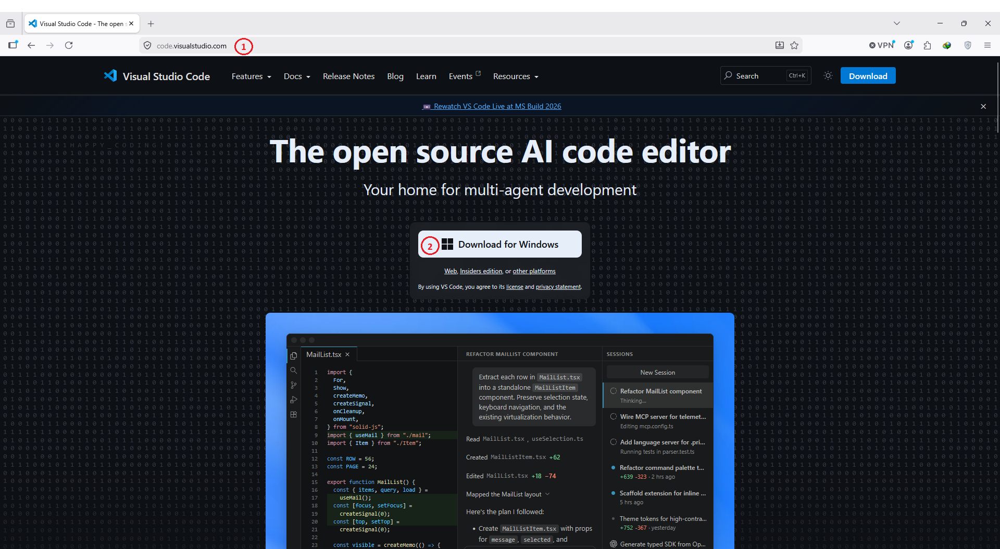
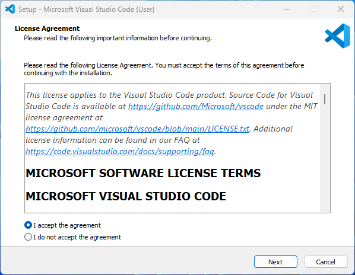
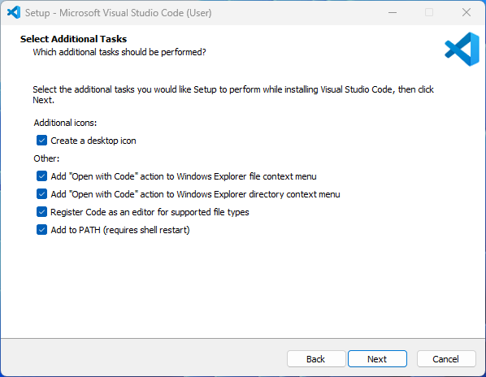
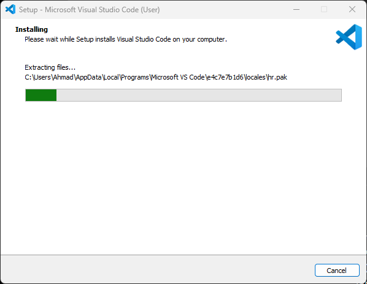
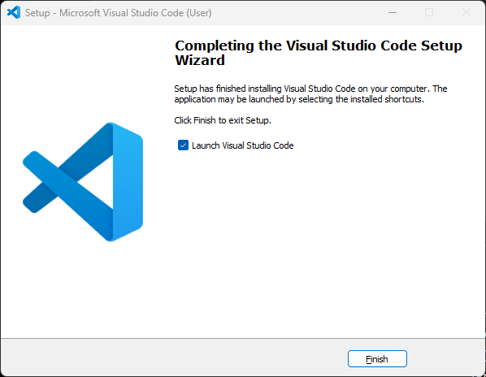

# بخش ۱ — Visual Studio Code چیست؟

🌐 Language: **فارسی** | [English](../README.md)

در درس قبل، پایتون را روی سیستم خود نصب کردید.

حالا به محیطی نیاز دارید که بتوانید برنامه‌های پایتون را در آن بنویسید، ویرایش کنید و مدیریت کنید.

اینجاست که **Visual Studio Code** یا به اختصار **VS Code** وارد می‌شود.

---

## VS Code چیست؟

Visual Studio Code یک ویرایشگر کد رایگان است که توسط شرکت Microsoft توسعه داده شده است.

این نرم‌افزار به شما کمک می‌کند کدهای خود را راحت‌تر بنویسید، ویرایش کنید، مدیریت کنید و اجرا کنید.

برخلاف مفسر پایتون، VS Code برای اجرای پایتون ضروری نیست.

بلکه محیطی مناسب و حرفه‌ای برای برنامه‌نویسی در اختیار شما قرار می‌دهد.

---

## چرا از VS Code استفاده می‌کنیم؟

VS Code یکی از محبوب‌ترین ویرایشگرهای کدنویسی در جهان است، زیرا:

- رایگان است.
- سبک و سریع است.
- روی Windows، macOS و Linux اجرا می‌شود.
- قابلیت شخصی‌سازی بالایی دارد.
- از صدها زبان برنامه‌نویسی پشتیبانی می‌کند.

همچنین هزاران افزونه (Extension) برای آن وجود دارد که امکانات بیشتری در اختیار شما قرار می‌دهند.

---

## تفاوت VS Code و Python

بسیاری از افراد مبتدی تصور می‌کنند VS Code همان پایتون است.

درحالی‌که این دو نقش‌های متفاوتی دارند.

| Python | Visual Studio Code |
|---------|--------------------|
| زبان برنامه‌نویسی | ویرایشگر کد |
| برنامه‌ها را اجرا می‌کند | به نوشتن برنامه کمک می‌کند |
| ضروری است | اختیاری است |

<br />
پایتون موتور اجرای برنامه است.

VS Code محیط کاری برنامه‌نویس است.

---

## چرا در این کتاب از VS Code استفاده می‌کنیم؟

از این درس به بعد، تمام مثال‌ها و تمرین‌های کتاب در Visual Studio Code انجام خواهند شد.

استفاده از یک محیط ثابت، یادگیری را ساده‌تر و منظم‌تر می‌کند.

---

## خلاصه این بخش

- VS Code یک ویرایشگر کد رایگان است.
- توسط Microsoft توسعه داده شده است.
- به نوشتن و مدیریت کد کمک می‌کند.
- VS Code خودِ پایتون نیست.
- در بخش بعد، VS Code را از وب‌سایت رسمی دانلود خواهیم کرد.

# بخش ۲ — دانلود Visual Studio Code

حالا که با Visual Studio Code آشنا شدید، وقت آن رسیده است که آن را دانلود کنید.

VS Code یک نرم‌افزار رایگان است و می‌توانید آن را مستقیماً از وب‌سایت رسمی Microsoft دریافت کنید.

---

## دانلود از وب‌سایت رسمی

مرورگر خود را باز کنید و وارد آدرس زیر شوید:

https://code.visualstudio.com

همیشه Visual Studio Code را از وب‌سایت رسمی Microsoft دانلود کنید.

با این کار:

- آخرین نسخه پایدار را دریافت می‌کنید.
- به‌روزرسانی‌های رسمی را دریافت خواهید کرد.
- فایل نصب کاملاً معتبر و امن خواهد بود.
- نسخه مناسب سیستم‌عامل شما دانلود می‌شود.

---

## دانلود نسخه مناسب سیستم‌عامل

وب‌سایت VS Code معمولاً سیستم‌عامل شما را به‌صورت خودکار تشخیص می‌دهد.

در بیشتر مواقع، یک دکمه بزرگ دانلود متناسب با سیستم شما نمایش داده می‌شود.

روی آن کلیک کنید تا دانلود آغاز شود.

> **به شکل ۱ مراجعه کنید.**

<p align="center">
  
</p>

<p align="center">
  <em>شکل ۱ — دانلود Visual Studio Code از وب‌سایت رسمی Microsoft.</em>
</p>

---

## سیستم‌عامل‌های پشتیبانی‌شده

Visual Studio Code برای سیستم‌عامل‌های زیر منتشر می‌شود:

- Windows
- macOS
- Linux

اگر نسخه مناسب سیستم شما به‌صورت خودکار نمایش داده نشد، می‌توانید آن را به‌صورت دستی از صفحه دانلود انتخاب کنید.

---

> 💡 **نکته کاربردی**
>
> مگر اینکه دلیل خاصی داشته باشید، همیشه نسخه **Stable** را دانلود کنید و از نسخه **Insiders** استفاده نکنید.

---

## قبل از ادامه

بعد از پایان دانلود، هنوز فایل نصب را اجرا نکنید.

در بخش بعد، نصب Visual Studio Code را مرحله‌به‌مرحله انجام خواهیم داد.

---

## خلاصه این بخش

- VS Code را فقط از وب‌سایت رسمی Microsoft دانلود کنید.
- وب‌سایت معمولاً سیستم‌عامل شما را به‌صورت خودکار تشخیص می‌دهد.
- نسخه Stable را دانلود کنید.
- در بخش بعد، VS Code را نصب خواهیم کرد.

# بخش ۳ — نصب Visual Studio Code

بعد از دانلود Visual Studio Code، نوبت به نصب آن می‌رسد.

فرآیند نصب ساده است و معمولاً فقط چند دقیقه زمان می‌برد.

---

## اجرای فایل نصب

فایل نصب دانلودشده را پیدا کنید.

نام آن معمولاً مشابه نمونه زیر است:

```text
VSCodeUserSetup-x64-1.xx.x.exe
```

روی فایل دوبار کلیک کنید تا نصب آغاز شود.

---

## پذیرش توافق‌نامه

متن توافق‌نامه را مطالعه کنید.

گزینه زیر را انتخاب کنید:

```text
I accept the agreement
```

سپس روی **Next** کلیک کنید.

> **به شکل ۲ مراجعه کنید.**

<p align="center">
  
</p>

<p align="center">
  <em>شکل ۲ — پذیرش توافق‌نامه نصب.</em>
</p>

---

## انتخاب محل نصب

برای اکثر کاربران، محل نصب پیش‌فرض مناسب است.

بدون تغییر تنظیمات، روی **Next** کلیک کنید.

> 💡 **نکته کاربردی**
>
> مگر اینکه دلیل خاصی داشته باشید، مسیر پیش‌فرض نصب را تغییر ندهید.

---

## انتخاب گزینه‌های اضافی

در این مرحله، نصب‌کننده چند گزینه اختیاری نمایش می‌دهد.

توصیه می‌شود گزینه‌های زیر را فعال کنید:

- ✔ ایجاد میانبر روی Desktop
- ✔ اضافه کردن **Open with Code** برای فایل‌ها
- ✔ اضافه کردن **Open with Code** برای پوشه‌ها
- ✔ ثبت VS Code به‌عنوان ویرایشگر فایل‌های پشتیبانی‌شده
- ✔ اضافه کردن VS Code به PATH

> **به شکل ۳ مراجعه کنید.**

<p align="center">
  
</p>

<p align="center">
  <em>شکل ۳ — گزینه‌های پیشنهادی هنگام نصب.</em>
</p>

---

> ⚠️ **مهم**
>
> مطمئن شوید گزینه **Add to PATH** فعال باشد تا بتوانید VS Code را از طریق خط فرمان نیز اجرا کنید.

---

## نصب Visual Studio Code

روی دکمه **Install** کلیک کنید.

منتظر بمانید تا نوار پیشرفت نصب کامل شود.

> **به شکل ۴ مراجعه کنید.**

<p align="center">
  
</p>

<p align="center">
  <em>شکل ۴ — نصب Visual Studio Code.</em>
</p>

---

## پایان نصب

پس از پایان نصب، روی **Finish** کلیک کنید.

گزینه **Launch Visual Studio Code** را فعال نگه دارید تا VS Code پس از پایان نصب به‌صورت خودکار اجرا شود.

> **به شکل ۵ مراجعه کنید.**

<p align="center">
  
</p>

<p align="center">
  <em>شکل ۵ — نصب Visual Studio Code با موفقیت به پایان رسید.</em>
</p>

---

## خلاصه این بخش

- فایل نصب را اجرا کردید.
- توافق‌نامه را پذیرفتید.
- تنظیمات پیش‌فرض را حفظ کردید.
- گزینه‌های پیشنهادی را فعال کردید.
- Visual Studio Code را با موفقیت نصب کردید.

---