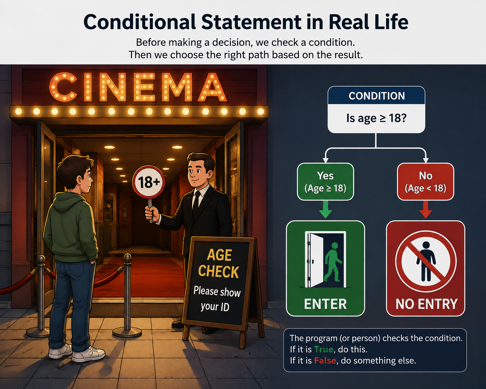
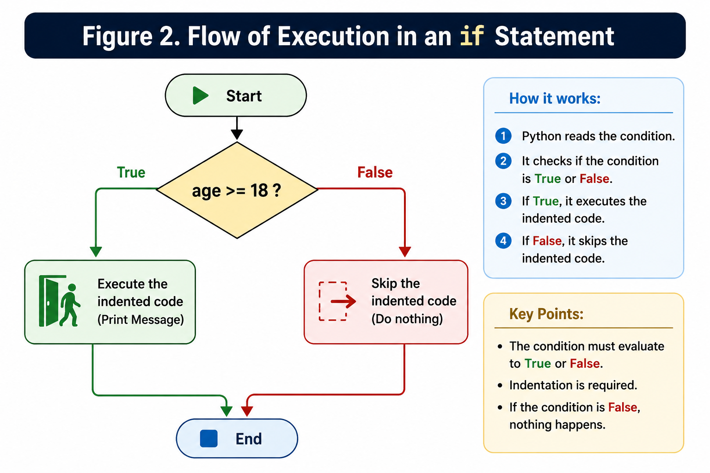
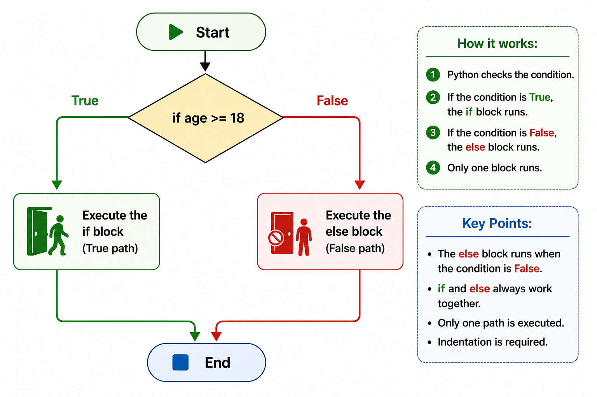
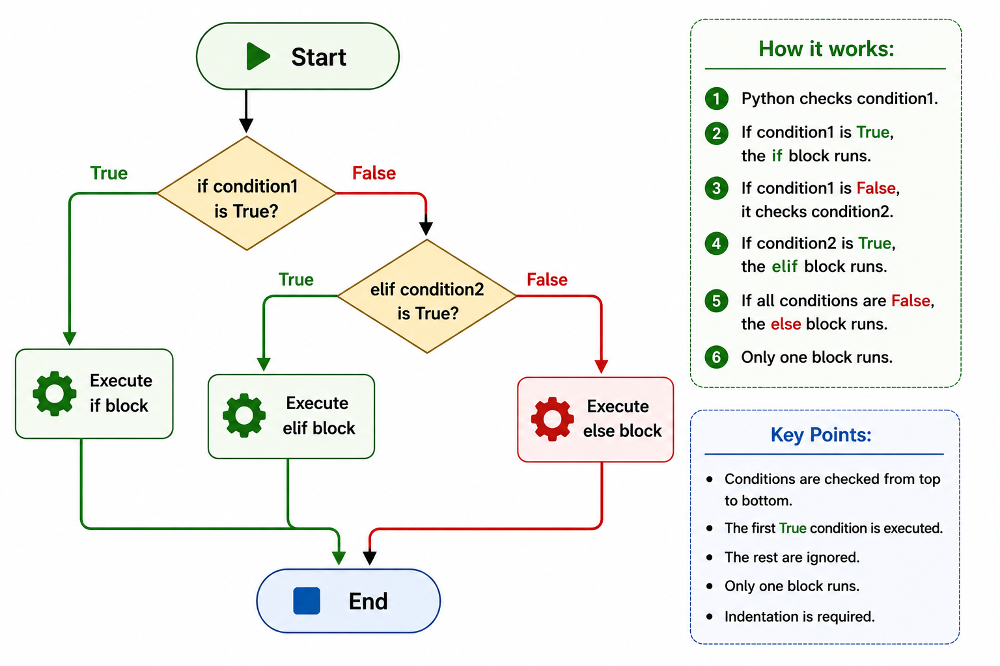

# Part 1 — What Is a Conditional Statement?

🌐 Language: **English** | [فارسی](fa/README.md)

Not every program should perform the same actions every time it runs.

Sometimes, a program needs to make a decision.

For example:

- Should a user be allowed to log in?
- Should a student pass an exam?
- Should a customer receive a discount?
- Should a game continue or end?

Before making a decision, a program must check one or more conditions.

This is called a **conditional statement**.

---

## A Real-World Example

Imagine you are standing at the entrance of a movie theater.

The theater has a simple rule:

> Only people who are **18 years old or older** can enter.

Before allowing someone to enter, the staff checks the person's age.

If the person is 18 or older, they may enter.

Otherwise, they cannot.

Programs work in exactly the same way.

They first check a condition, then decide what to do.

## Figure 1

<p align="center">
  
</p>

<p align="center">
  <em>A real-world example of a conditional decision.</em>
</p>

---

## What Is a Condition?

A condition is simply a question that has only two possible answers:

- Yes
- No

In Python, these answers are represented as:

- `True`
- `False`

Example:

```
Is 20 greater than 18?
```

Answer:

```
True
```

Another example:

```
Is 10 greater than 50?
```

Answer:

```
False
```

Python uses these answers to decide which code should run.

---

## Where Are Conditional Statements Used?

Conditional statements are everywhere.

For example:

- Login systems
- ATM machines
- Online stores
- Mobile applications
- Video games

Almost every real-world application uses conditions.

---

## In the Next Part

In the next part, you will learn the first conditional statement in Python:

```python
if
```

---

# Part 2 — The `if` Statement

Now that you know what a conditional statement is, it's time to write one in Python.

Python uses the `if` statement to make decisions.

The word `if` simply means:

> "If this condition is true, do something."

---

## Basic Syntax

```python
if condition:
    statement
```

There are two important things to notice:

- A colon (`:`) appears at the end of the first line.
- The code inside the `if` statement is indented.

Both are required in Python.

---

## How the `if` Statement Works

Python follows these steps:

1. Read the condition.
2. Check whether it is `True` or `False`.
3. If it is `True`, execute the indented code.
4. If it is `False`, skip the indented code.

---

## Example

Imagine the movie theater from the previous section.

The rule is:

> People who are 18 or older may enter.

In Python:

```python
age = 36

if age >= 18:
    print("You can enter the movie theater.")
```

Output:

```text
You can enter the movie theater.
```

Since the condition is `True`, Python executes the `print()` statement.

---

## Another Example

```python
age = 15

if age >= 18:
    print("You can enter the movie theater.")
```

Output:

```text
```

Nothing is printed because the condition is `False`.

Python simply skips the code inside the `if` statement.

---

## Important Note

An `if` statement only performs an action when the condition is `True`.

If the condition is `False`, nothing happens.

In the next part, you will learn how to tell Python what to do when the condition is `False`.

## Figure 2

<p align="center">
  
</p>

<p align="center">
  <em>Figure 2. The execution flow of an `if` statement based on the condition result.</em>
</p>

---

# Part 3 — The `else` Statement

In the previous part, you learned that an `if` statement only runs when its condition is `True`.

But what happens when the condition is `False`?

Sometimes, we want the program to do something different when a condition is not met.

Python uses the `else` statement for this situation.

The word `else` means:

> "If the condition is not true, do this instead."

---

## Basic Syntax

```python
if condition:
    statement
else:
    statement
```

The `else` block does not have a condition.

It runs automatically when the `if` condition is `False`.

---

## Example

Let's return to the movie theater example.

The rule is:

> People who are 18 or older can enter.

Python code:

```python
age = 15

if age >= 18:
    print("You can enter the movie theater.")
else:
    print("You cannot enter the movie theater.")
```

Output:

```text
You cannot enter the movie theater.
```

The condition `age >= 18` is `False`, so Python runs the `else` block.

---

## Another Example

```python
temperature = 30

if temperature > 35:
    print("It is very hot.")
else:
    print("The weather is normal.")
```

Output:

```text
The weather is normal.
```

---

## How `if` and `else` Work Together

Python follows these steps:

1. Check the `if` condition.
2. If the condition is `True`, run the `if` block.
3. If the condition is `False`, run the `else` block.

Only one of the two blocks will execute.

---

## Important Note

An `if` statement and an `else` statement always work as a pair.

You cannot write `else` without an `if` before it.

---

## Figure 3

<p align="center">
  
</p>

<p align="center">
  <em>Figure 3. The execution flow of an `if-else` statement based on the condition result.</em>
</p>

---

# Part 4 — The `elif` Statement

Sometimes, we need to check more than one condition.

Using only `if` and `else` is not enough.

Python provides the `elif` statement for this purpose.

The word `elif` means:

> "Else if this condition is true."

It allows Python to test multiple conditions one by one.

---

## Basic Syntax

```python
if condition1:
    statement
elif condition2:
    statement
else:
    statement
```

Python checks each condition from top to bottom.

As soon as one condition is `True`, Python executes its block and ignores the rest.

---

## Example

Suppose we want to display a message based on a student's score.

```python
score = 85

if score >= 90:
    print("Excellent")
elif score >= 75:
    print("Good")
else:
    print("Needs Improvement")
```

Output:

```text
Good
```

Python first checks:

```python
score >= 90
```

This is `False`.

Then it checks:

```python
score >= 75
```

This is `True`, so it prints:

```text
Good
```

The `else` block is skipped.

---

## Another Example

```python
temperature = 38

if temperature >= 40:
    print("Very Hot")
elif temperature >= 30:
    print("Warm")
else:
    print("Cool")
```

Output:

```text
Warm
```

---

## Important Note

Python checks conditions in order.

The first condition that is `True` will be executed.

The remaining conditions will not be checked.

---

<p align="center">
  
</p>

<p align="center">
  <em>Figure 4. Execution flow of an <code>if-elif-else</code> statement.</em>
</p>

---

# Part 5 — Logical Operators (`and`, `or`, `not`)

## Part 5.1 — The `and` Operator

The `and` operator is used when we want **all conditions** to be true before executing a block of code.

Think about a real-life example:

> You can enter the movie theater if you are 18 or older **and** you have a ticket.

Both conditions must be true:

```python
age >= 18
has_ticket == True
```

If one of these conditions is false, the whole condition becomes false.

---

## Basic Syntax

```python
if condition1 and condition2:
    statement
```

Python checks both conditions.

The code inside the `if` block runs only when both conditions are `True`.

---

## Example

```python
age = 36
has_ticket = True

if age >= 18 and has_ticket:
    print("You can enter the movie theater.")
```

Output:

```text
You can enter the movie theater.
```

Let's look at the conditions:

```python
age >= 18
```

The result is:

```text
True
```

and:

```python
has_ticket
```

The result is:

```text
True
```

Because both conditions are true, Python executes the code inside the `if` block.

---

## Another Example

```python
username = "ahmad"
password = "python123"

if username == "ahmad" and password == "python123":
    print("Login successful.")
```

Output:

```text
Login successful.
```

The user can log in only when both the username and password are correct.

---

## Important Note

The `and` operator works like the word **"both"** in everyday language.

For example:

> I will go outside if it is sunny **and** I have free time.

Both conditions must happen together.

---

## Part 5.2 — The `or` Operator

The `or` operator is used when we want **at least one condition** to be true before executing a block of code.

Think about a real-life example:

> You can enter a competition if you are a student **or** you have a special invitation.

In this situation, you do not need both conditions.

Having one of them is enough.

The conditions are:

```python
is_student == True
has_invitation == True
```

If at least one condition is `True`, the whole condition becomes `True`.

---

## Basic Syntax

```python
if condition1 or condition2:
    statement
```

Python checks all conditions connected with `or`.

The code inside the `if` block runs when at least one condition is `True`.

---

## Example

```python
is_student = True
has_invitation = False

if is_student or has_invitation:
    print("You can join the competition.")
```

Output:

```text
You can join the competition.
```

Let's check the conditions:

```python
is_student
```

Result:

```text
True
```

and:

```python
has_invitation
```

Result:

```text
False
```

Because one of the conditions is `True`, Python executes the `if` block.

---

## Another Example

```python
day = "Friday"

if day == "Friday" or day == "Saturday":
    print("It is the weekend.")
```

Output:

```text
It is the weekend.
```

The condition is true because the day is one of the accepted options.

---

## Important Note

The `or` operator works like the word **"one of them"** in everyday language.

For example:

> I will watch a movie if I have free time **or** if my friend invites me.

Only one condition needs to be true.

---

## Part 5.3 — The `not` Operator

The `not` operator is used to reverse the result of a condition.

It changes:

- `True` to `False`
- `False` to `True`

Think about a real-life example:

> You can enter the restricted area if you are **not** an unauthorized person.

In other words:

- If the person is unauthorized → access is denied.
- If the person is not unauthorized → access is allowed.

---

## Basic Syntax

```python
if not condition:
    statement
```

Python first checks the condition, then reverses its result.

---

## Example

```python
is_closed = False

if not is_closed:
    print("The store is open.")
```

Output:

```text
The store is open.
```

Let's understand what happens:

The original value is:

```python
is_closed = False
```

The `not` operator reverses it:

```text
not False → True
```

Because the final result is `True`, Python runs the `if` block.

---

## Another Example

```python
has_permission = False

if not has_permission:
    print("Access denied.")
```

Output:

```text
Access denied.
```

The user does not have permission, so the condition becomes true after using `not`.

---

## Important Note

The `not` operator does not check a new condition.

It only changes the result of an existing condition.

For example:

```python
not True
```

becomes:

```text
False
```

and:

```python
not False
```

becomes:

```text
True
```

---

## Logical Operators Truth Table

The following table shows how logical operators work with different combinations of `True` and `False` values.

| Condition A | Condition B | A and B | A or B |
|---|---|---|---|
| True | True | True | True |
| True | False | False | True |
| False | True | False | True |
| False | False | False | False |

For the `not` operator:

| Condition | not Condition |
|---|---|
| True | False |
| False | True |

---

# Part 6 — Nested `if` Statements

Sometimes, a program needs to check a condition only after another condition becomes true.

In these situations, we can place one `if` statement inside another `if` statement.

This is called a **Nested `if` statement**.

---

## What Is a Nested `if`?

A nested `if` is an `if` statement written inside another `if` statement.

The inner `if` only runs when the outer `if` condition is `True`.

---

## Basic Syntax

```python
if condition1:
    if condition2:
        statement
```

Python first checks the outer condition.

If it is true, Python moves inside and checks the second condition.

---

## Example

Imagine an online account login system.

The program first checks if the user has an account.

Then it checks if the password is correct.

```python
has_account = True
password_correct = True

if has_account:
    if password_correct:
        print("Login successful.")
```

Output:

```text
Login successful.
```

---

## Step-by-Step Execution

Python follows these steps:

1. Check:

```python
has_account
```

Result:

```text
True
```

The program enters the first `if` block.

2. Then it checks:

```python
password_correct
```

Result:

```text
True
```

The program executes:

```text
Login successful.
```

---

## Real-world Example

Think about entering a secure building.

First:

> Do you have an access card?

If yes:

> Is your password correct?

Only after passing the first check, the second check happens.

This is the idea behind Nested `if`.

---

## Common Mistakes

A common mistake is creating too many nested conditions.

For example:

```python
if condition1:
    if condition2:
        if condition3:
            statement
```

Too many nested levels make the code harder to read.

In larger programs, we often use logical operators like `and` to simplify conditions.

---

