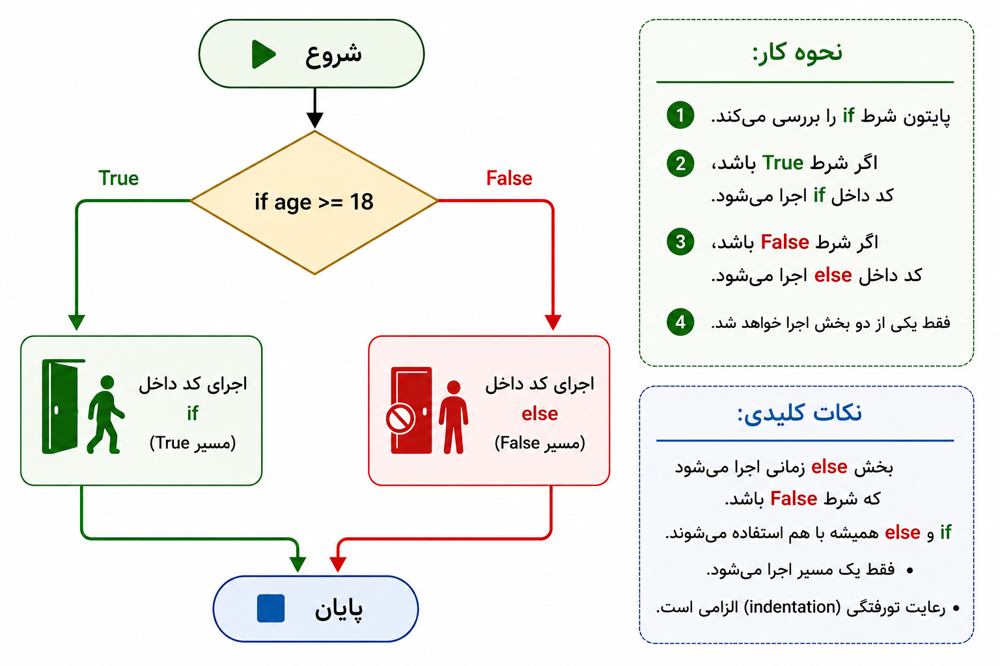

# بخش ۱ — دستور شرطی چیست؟

🌐 Language: **فارسی** | [English](../README.md)

همه برنامه ها قرار نیست هر بار که اجرا می شوند، دقیقاً یک کار را انجام دهند.

گاهی اوقات یک برنامه باید **تصمیم بگیرد**.

برای مثال:

- آیا کاربر اجازه ورود دارد؟
- آیا دانش آموز قبول شده است؟
- آیا مشتری شامل تخفیف می شود؟
- آیا بازی ادامه پیدا کند یا تمام شود؟

قبل از اینکه برنامه تصمیم بگیرد، باید یک یا چند شرط را بررسی کند.

به این فرآیند **دستور شرطی (Conditional Statement)** گفته می شود.

---

## یک مثال روزمره

تصور کنید جلوی در ورودی یک سینما ایستاده اید.

قانون سینما بسیار ساده است:

> فقط افرادی که **18 سال یا بیشتر** دارند، اجازه ورود دارند.

قبل از اینکه مسئول ورودی اجازه ورود بدهد، سن شما را بررسی می کند.

اگر 18 سال یا بیشتر داشته باشید، وارد سینما می شوید.

در غیر این صورت، اجازه ورود نخواهید داشت.

برنامه های کامپیوتری نیز دقیقاً به همین شکل تصمیم می گیرند.

ابتدا یک شرط را بررسی می کنند و سپس بر اساس نتیجه، مسیر مناسب را انتخاب می کنند.

## شکل ۱

<p align="center">
  
</p>

<p align="center">
  <em>یک نمونه واقعی از تصمیم گیری بر اساس یک شرط.</em>
</p>

---

## شرط چیست؟

شرط در واقع یک سؤال است که فقط دو پاسخ دارد:

- بله
- خیر

در پایتون این دو پاسخ با مقدار های زیر نمایش داده می شوند:

- `True`
- `False`

برای مثال:

```
آیا 20 از 18 بزرگ تر است؟
```

پاسخ:

```
True
```

مثال دیگر:

```
آیا 10 از 50 بزرگ تر است؟
```

پاسخ:

```
False
```

پایتون از همین نتیجه ها برای تصمیم گیری استفاده می کند.

---

## دستور های شرطی کجا استفاده می شوند؟

تقریباً در همه برنامه های واقعی.

برای مثال:

- سیستم ورود کاربران
- دستگاه های خودپرداز
- فروشگاه های اینترنتی
- اپلیکیشن های موبایل
- بازی های کامپیوتری

تقریباً هیچ برنامه واقعی بدون شرط وجود ندارد.

---

## در بخش بعدی

در بخش بعد با اولین دستور شرطی پایتون آشنا می شوید:

```python
if
```

---

# بخش ۲ — دستور `if`

حالا که با مفهوم دستور شرطی آشنا شدید، وقت آن رسیده است که اولین دستور شرطی پایتون را یاد بگیرید.

پایتون برای تصمیم گیری از دستور `if` استفاده می کند.

کلمه `if` به سادگی یعنی:

> «اگر این شرط درست بود، این کار را انجام بده.»

---

## ساختار کلی

```python
if condition:
    statement
```

در این ساختار به دو نکته مهم دقت کنید:

- در انتهای خط اول باید علامت `:` قرار بگیرد.
- کد های داخل دستور `if` باید با **تورفتگی (Indentation)** نوشته شوند.

هر دو مورد در پایتون الزامی هستند.

---

## دستور `if` چگونه کار می کند؟

پایتون مراحل زیر را انجام می دهد:

1. شرط را می خواند.
2. بررسی می کند که نتیجه شرط `True` است یا `False`.
3. اگر نتیجه `True` باشد، کد های داخل `if` را اجرا می کند.
4. اگر نتیجه `False` باشد، از آن کد ها عبور می کند.

---

## مثال

همان مثال سینما را در نظر بگیرید.

قانون این بود:

> افراد 18 سال یا بیشتر اجازه ورود دارند.

در پایتون می توانیم این قانون را به شکل زیر بنویسیم:

```python
age = 36

if age >= 18:
    print("You can enter the movie theater.")
```

خروجی:

```text
You can enter the movie theater.
```

چون شرط درست است، دستور `print()` اجرا می شود.

---

## یک مثال دیگر

```python
age = 15

if age >= 18:
    print("You can enter the movie theater.")
```

خروجی:

```text
```

در این مثال هیچ چیزی نمایش داده نمی شود، زیرا شرط نادرست است.

پایتون به سادگی از کد های داخل `if` عبور می کند.

---

## نکته مهم

دستور `if` فقط زمانی کاری انجام می دهد که شرط درست باشد.

اگر شرط نادرست باشد، هیچ اتفاقی نمی افتد.

در بخش بعد یاد می گیرید چگونه برای حالت نادرست نیز دستور جداگانه ای بنویسید.

## ۲ شکل 

<p align="center">
  
</p>

<p align="center">
  <em>شکل ۲. روند تصمیم گیری و اجرای کد در دستور `if` بر اساس نتیجه شرط.</em>
</p>

---

# بخش ۳ — دستور `else`

در بخش قبل یاد گرفتید که دستور `if` فقط زمانی اجرا می شود که شرط آن `True` باشد.

اما وقتی شرط `False` باشد چه اتفاقی می افتد؟

گاهی اوقات می خواهیم برنامه زمانی که یک شرط برقرار نیست، کار دیگری انجام دهد.

پایتون برای این حالت از دستور `else` استفاده می کند.

کلمه `else` یعنی:

> «اگر شرط درست نبود، این کار را انجام بده.»

---

## ساختار کلی

```python
if condition:
    statement
else:
    statement
```

دستور `else` خودش شرطی ندارد.

این بخش زمانی به صورت خودکار اجرا می شود که شرط `if` برابر با `False` باشد.

---

## مثال

دوباره مثال سینما را در نظر بگیرید.

قانون این است:

> افراد 18 سال یا بیشتر اجازه ورود دارند.

کد پایتون:

```python
age = 15

if age >= 18:
    print("You can enter the movie theater.")
else:
    print("You cannot enter the movie theater.")
```

خروجی:

```text
You cannot enter the movie theater.
```

شرط `age >= 18` برابر با `False` است، بنابراین پایتون کد داخل `else` را اجرا می کند.

---

## یک مثال دیگر

```python
temperature = 30

if temperature > 35:
    print("It is very hot.")
else:
    print("The weather is normal.")
```

خروجی:

```text
The weather is normal.
```

---

## ترکیب `if` و `else` چگونه کار می کند؟

پایتون مراحل زیر را انجام می دهد:

1. شرط `if` را بررسی می کند.
2. اگر شرط `True` باشد، کد داخل `if` اجرا می شود.
3. اگر شرط `False` باشد، کد داخل `else` اجرا می شود.

فقط یکی از این دو بخش اجرا خواهد شد.

---

## نکته مهم

دستور `if` و `else` همیشه با هم استفاده می شوند.

نمی توانید بدون داشتن یک `if`، از `else` استفاده کنید.

---

## شکل ۳

<p align="center">
  
</p>

<p align="center">
  <em>شکل ۳. روند اجرای دستور `if-else` بر اساس نتیجه شرط.</em>
</p>

---

# بخش ۴ — دستور `elif`

گاهی اوقات لازم است بیشتر از یک شرط را بررسی کنیم.

در چنین شرایطی استفاده از `if` و `else` به تنهایی کافی نیست.

پایتون برای این کار دستور `elif` را در اختیار ما قرار داده است.

کلمه `elif` در واقع مخفف عبارت زیر است:

> **Else If**

یعنی:

> «در غیر این صورت، اگر این شرط برقرار بود...»

به کمک `elif` می توان چندین شرط را به ترتیب بررسی کرد.

---

## ساختار کلی

```python
if condition1:
    statement
elif condition2:
    statement
else:
    statement
```

پایتون شرط ها را از بالا به پایین بررسی می کند.

به محض اینکه یکی از شرط ها درست باشد، همان بخش اجرا می شود و بقیه شرط ها دیگر بررسی نخواهند شد.

---

## مثال

فرض کنید می خواهیم بر اساس نمره یک دانش آموز، پیام مناسبی نمایش دهیم.

```python
score = 85

if score >= 90:
    print("Excellent")
elif score >= 75:
    print("Good")
else:
    print("Needs Improvement")
```

خروجی:

```text
Good
```

ابتدا پایتون این شرط را بررسی می کند:

```python
score >= 90
```

نتیجه نادرست است.

سپس شرط بعدی را بررسی می کند:

```python
score >= 75
```

این شرط درست است.

بنابراین خروجی زیر نمایش داده می شود:

```text
Good
```

و دیگر بخش `else` اجرا نمی شود.

---

## یک مثال دیگر

```python
temperature = 38

if temperature >= 40:
    print("Very Hot")
elif temperature >= 30:
    print("Warm")
else:
    print("Cool")
```

خروجی:

```text
Warm
```

---

## نکته مهم

پایتون شرط ها را به ترتیب بررسی می کند.

اولین شرطی که درست باشد اجرا می شود.

بعد از اجرای آن، بقیه شرط ها دیگر بررسی نخواهند شد.

---

<p align="center">
  
</p>

<p align="center">
  <em>شکل ۴. روند اجرای دستور <code>if-elif-else</code> بر اساس ترتیب بررسی شرط ها.</em>
</p>

---

# بخش ۵ — عملگرهای منطقی (`and`, `or`, `not`)

## بخش ۵.۱ — عملگر `and`

عملگر `and` زمانی استفاده می شود که بخواهیم **تمام شرط ها** درست باشند تا یک بخش از کد اجرا شود.

یک مثال روزمره:

> شما می توانید وارد سینما شوید اگر ۱۸ سال یا بیشتر داشته باشید **و** بلیت داشته باشید.

هر دو شرط باید درست باشند:

```python
age >= 18
has_ticket == True
```

اگر حتی یکی از این شرط ها نادرست باشد، کل شرط نادرست خواهد شد.

---

## ساختار کلی

```python
if condition1 and condition2:
    statement
```

پایتون هر دو شرط را بررسی می کند.

کد داخل بخش `if` فقط زمانی اجرا می شود که هر دو شرط برابر با `True` باشند.

---

## مثال

```python
age = 36
has_ticket = True

if age >= 18 and has_ticket:
    print("You can enter the movie theater.")
```

خروجی:

```text
You can enter the movie theater.
```

شرط ها را بررسی کنیم:

```python
age >= 18
```

نتیجه:

```text
True
```

و:

```python
has_ticket
```

نتیجه:

```text
True
```

چون هر دو شرط درست هستند، پایتون کد داخل `if` را اجرا می کند.

---

## یک مثال دیگر

```python
username = "ahmad"
password = "python123"

if username == "ahmad" and password == "python123":
    print("Login successful.")
```

خروجی:

```text
Login successful.
```

کاربر فقط زمانی می تواند وارد شود که هم نام کاربری و هم رمز عبور درست باشند.

---

## نکته مهم

عملگر `and` شبیه کلمه **«هر دو»** در زبان روزمره عمل می کند.

مثلاً:

> من بیرون می روم اگر هوا آفتابی باشد **و** وقت آزاد داشته باشم.

هر دو شرط باید همزمان برقرار باشند.

---

## بخش ۵.۲ — عملگر `or`

عملگر `or` زمانی استفاده می شود که بخواهیم **حداقل یکی از شرط ها** درست باشد تا یک بخش از کد اجرا شود.

یک مثال روزمره:

> شما می توانید در مسابقه شرکت کنید اگر دانش آموز باشید **یا** دعوت نامه ویژه داشته باشید.

در این حالت لازم نیست هر دو شرط برقرار باشند.

داشتن یکی از آن ها کافی است.

شرط ها:

```python
is_student == True
has_invitation == True
```

اگر حداقل یکی از شرط ها `True` باشد، کل شرط `True` خواهد شد.

---

## ساختار کلی

```python
if condition1 or condition2:
    statement
```

پایتون تمام شرط هایی که با `or` به هم متصل شده اند را بررسی می کند.

کد داخل بخش `if` زمانی اجرا می شود که حداقل یکی از شرط ها درست باشد.

---

## مثال

```python
is_student = True
has_invitation = False

if is_student or has_invitation:
    print("You can join the competition.")
```

خروجی:

```text
You can join the competition.
```

شرط ها را بررسی کنیم:

```python
is_student
```

نتیجه:

```text
True
```

و:

```python
has_invitation
```

نتیجه:

```text
False
```

چون یکی از شرط ها درست است، پایتون کد داخل `if` را اجرا می کند.

---

## یک مثال دیگر

```python
day = "Friday"

if day == "Friday" or day == "Saturday":
    print("It is the weekend.")
```

خروجی:

```text
It is the weekend.
```

شرط درست است، چون روز وارد شده یکی از گزینه های قابل قبول است.

---

## نکته مهم

عملگر `or` شبیه کلمه **«یکی از آن ها»** در زبان روزمره عمل می کند.

مثلاً:

> من فیلم می بینم اگر وقت آزاد داشته باشم **یا** دوستم من را دعوت کند.

فقط یکی از شرط ها باید درست باشد.

---

## بخش ۵.۳ — عملگر `not`

عملگر `not` برای برعکس کردن نتیجه یک شرط استفاده می شود.

این عملگر مقدار را تغییر می دهد:

- `True` را به `False`
- `False` را به `True`

یک مثال روزمره:

> شما می توانید وارد بخش محدود شده شوید اگر **شخص غیرمجاز نباشید**.

یعنی:

- اگر شخص غیرمجاز باشد → اجازه ورود ندارد.
- اگر شخص غیرمجاز نباشد → اجازه ورود دارد.

---

## ساختار کلی

```python
if not condition:
    statement
```

پایتون ابتدا شرط را بررسی می کند و سپس نتیجه آن را برعکس می کند.

---

## مثال

```python
is_closed = False

if not is_closed:
    print("The store is open.")
```

خروجی:

```text
The store is open.
```

بیایید بررسی کنیم چه اتفاقی افتاده است:

مقدار اولیه:

```python
is_closed = False
```

عملگر `not` آن را برعکس می کند:

```text
not False → True
```

چون نتیجه نهایی `True` است، پایتون کد داخل `if` را اجرا می کند.

---

## یک مثال دیگر

```python
has_permission = False

if not has_permission:
    print("Access denied.")
```

خروجی:

```text
Access denied.
```

کاربر اجازه دسترسی ندارد، بنابراین با استفاده از `not` نتیجه شرط به `True` تبدیل می شود.

---

## نکته مهم

عملگر `not` یک شرط جدید ایجاد نمی کند.

فقط نتیجه یک شرط موجود را برعکس می کند.

مثلاً:

```python
not True
```

تبدیل می شود به:

```text
False
```

و:

```python
not False
```

تبدیل می شود به:

```text
True
```

---

## جدول عملگرها ی منطقی 

جدول زیر نشان می دهد که عملگرهای منطقی با ترکیب های مختلف `True` و `False` چگونه عمل می کنند.

| شرط A | شرط B | A and B | A or B |
|---|---|---|---|
| True | True | True | True |
| True | False | False | True |
| False | True | False | True |
| False | False | False | False |

برای عملگر `not`:

| شرط | not شرط |
|---|---|
| True | False |
| False | True |

---

# بخش ۶ — شرط های تو در تو (`Nested if`)

گاهی اوقات برنامه باید یک شرط را فقط زمانی بررسی کند که یک شرط دیگر درست باشد.

در این شرایط می توانیم یک دستور `if` را داخل یک دستور `if` دیگر قرار دهیم.

به این ساختار **شرط تو در تو** یا **Nested `if`** گفته می شود.

---

## Nested `if` چیست؟

یک `Nested if` یعنی یک دستور `if` داخل یک دستور `if` دیگر نوشته شود.

شرط داخلی فقط زمانی بررسی می شود که شرط بیرونی برابر با `True` باشد.

---

## ساختار کلی

```python
if condition1:
    if condition2:
        statement
```

پایتون ابتدا شرط بیرونی را بررسی می کند.

اگر نتیجه درست باشد، وارد بخش داخلی شده و شرط دوم را بررسی می کند.

---

## مثال

یک سیستم ورود به حساب کاربری را تصور کنید.

برنامه ابتدا بررسی می کند که کاربر حساب کاربری دارد یا نه.

سپس بررسی می کند که رمز عبور درست است یا نه.

```python
has_account = True
password_correct = True

if has_account:
    if password_correct:
        print("Login successful.")
```

خروجی:

```text
Login successful.
```

---

## اجرای مرحله به مرحله

پایتون این مراحل را انجام می دهد:

1. بررسی:

```python
has_account
```

نتیجه:

```text
True
```

برنامه وارد بخش اول `if` می شود.

2. سپس بررسی می کند:

```python
password_correct
```

نتیجه:

```text
True
```

برنامه دستور زیر را اجرا می کند:

```text
Login successful.
```

---

## مثال روزمره

ورود به یک ساختمان امن را تصور کنید.

ابتدا:

> آیا کارت دسترسی داری؟

اگر پاسخ مثبت باشد:

> آیا رمز عبور درست است؟

فقط بعد از عبور از بررسی اول، بررسی دوم انجام می شود.

این همان مفهوم شرط های تو در تو است.

---

## اشتباهات رایج

یکی از اشتباهات رایج، استفاده بیش از حد از شرط های تو در تو است.

مثلاً:

```python
if condition1:
    if condition2:
        if condition3:
            statement
```

تعداد زیاد لایه های تو در تو باعث می شود خواندن و نگهداری کد سخت تر شود.

در برنامه های بزرگ تر معمولاً از عملگرهای منطقی مانند `and` برای ساده تر کردن شرط ها استفاده می کنیم.

---

# بخش ۷ — ترکیب شرط ها (`Combining Conditions`)

در برنامه های واقعی، تصمیم گیری ها معمولاً به بیشتر از یک شرط وابسته هستند.

یک برنامه ممکن است قبل از تصمیم گیری، چند اطلاعات مختلف را بررسی کند.

مثلاً:

> یک کاربر زمانی می تواند وارد حساب کاربری شود که نام کاربری درست باشد، رمز عبور درست باشد و حساب فعال باشد.

در این حالت برنامه باید چند شرط را همزمان بررسی کند.

به این کار **ترکیب شرط ها** گفته می شود.

---

## چرا شرط ها را ترکیب می کنیم؟

گاهی یک شرط به تنهایی کافی نیست.

مثلاً:

```python
age >= 18
```

این شرط فقط سن کاربر را بررسی می کند.

اما یک سیستم واقعی ممکن است اطلاعات بیشتری نیاز داشته باشد:

```python
age >= 18
has_permission == True
```

ترکیب این دو شرط باعث می شود تصمیم دقیق تری گرفته شود.

---

## ترکیب شرط ها با `and`

از عملگر `and` زمانی استفاده می کنیم که تمام شرط ها باید درست باشند.

مثال:

```python
age = 36
has_permission = True

if age >= 18 and has_permission:
    print("Access granted.")
```

خروجی:

```text
Access granted.
```

برنامه اجازه دسترسی می دهد، چون هر دو شرط درست هستند.

---

## ترکیب شرط ها با `or`

از عملگر `or` زمانی استفاده می کنیم که حداقل یکی از شرط ها درست باشد.

مثال:

```python
is_student = False
has_discount_card = True

if is_student or has_discount_card:
    print("Discount available.")
```

خروجی:

```text
Discount available.
```

شرط درست است، چون یکی از شرط ها برقرار است.

---

## ترکیب شرط ها با `not`

از عملگر `not` برای برعکس کردن نتیجه یک شرط استفاده می کنیم.

مثال:

```python
is_blocked = False

if not is_blocked:
    print("User can continue.")
```

خروجی:

```text
User can continue.
```

برنامه ادامه پیدا می کند، چون کاربر مسدود نشده است.

---

## مثال واقعی

یک فروشگاه اینترنتی را تصور کنید.

کاربر زمانی می تواند سفارش خود را کامل کند که:

- وارد حساب کاربری شده باشد.
- سبد خرید خالی نباشد.
- امکان پرداخت وجود داشته باشد.

```python
is_logged_in = True
cart_has_items = True
payment_available = True

if is_logged_in and cart_has_items and payment_available:
    print("Order completed.")
```

خروجی:

```text
Order completed.
```

---

## اشتباهات رایج

یکی از اشتباهات رایج، نوشتن شرط های خیلی پیچیده است.

مثلاً:

```python
if age >= 18 and age <= 60 and has_card and not is_blocked:
    print("Allowed")
```

این شرط درست کار می کند، اما اگر شرط ها خیلی طولانی شوند، خواندن کد سخت تر می شود.

در برنامه های بزرگ تر بهتر است شرط های پیچیده را داخل متغیرهای جدا ذخیره کنیم.

---

# بخش ۸ — اشتباهات رایج در شرط ها

شرط ها یکی از مهم ترین بخش های برنامه نویسی هستند.

اما افراد مبتدی معمولاً اشتباهات کوچکی انجام می دهند که می تواند باعث تغییر رفتار برنامه یا ایجاد خطا شود.

شناخت این اشتباهات کمک می کند کدهای تمیزتر و قابل اعتماد تری بنویسیم.

---

## اشتباه ۱ — استفاده از `=` به جای `==`

یکی از رایج ترین اشتباهات، اشتباه گرفتن مقداردهی و مقایسه است.

عملگر `=` یک مقدار را داخل متغیر قرار می دهد.

عملگر `==` دو مقدار را با هم مقایسه می کند.

اشتباه:

```python
age = 18

if age = 18:
    print("Adult")
```

این کد باعث خطا می شود.

درست:

```python
age = 18

if age == 18:
    print("Adult")
```

خروجی:

```text
Adult
```

---

## اشتباه ۲ — فراموش کردن فاصله گذاری (Indentation)

پایتون برای مشخص کردن بخش های کد از فاصله گذاری استفاده می کند.

اشتباه:

```python
age = 20

if age >= 18:
print("Adult")
```

درست:

```python
age = 20

if age >= 18:
    print("Adult")
```

کدی که داخل `if` قرار می گیرد باید فاصله گذاری شود.

---

## اشتباه ۳ — ایجاد شرط های تو در توی زیاد

شرط های تو در تو کاربردی هستند، اما تعداد زیاد آن ها باعث سخت شدن خواندن کد می شود.

مثال:

```python
if user_exists:
    if password_correct:
        if account_active:
            print("Login successful.")
```

در برنامه های پیچیده بهتر است شرط ها را ترکیب کنیم:

```python
if user_exists and password_correct and account_active:
    print("Login successful.")
```

---

## اشتباه ۴ — بررسی نکردن تمام حالت ها

گاهی برنامه نویس فقط یک حالت را در نظر می گیرد.

مثال:

```python
score = 50

if score >= 60:
    print("Passed")
```

اگر امتیاز کمتر از ۶۰ باشد، هیچ اتفاقی نمی افتد.

روش بهتر:

```python
score = 50

if score >= 60:
    print("Passed")
else:
    print("Failed")
```

خروجی:

```text
Failed
```

---

## اشتباه ۵ — نوشتن شرط هایی که همیشه درست یا همیشه نادرست هستند

مثال:

```python
age = 20

if age >= 10 or age >= 18:
    print("Allowed")
```

این شرط همیشه درست است، چون هر عددی که بزرگ تر از ۱۸ باشد، حتماً بزرگ تر از ۱۰ هم هست.

نوشتن شرط های واضح باعث جلوگیری از نتایج غیرمنتظره می شود.

---

## نکات رفع اشکال

وقتی یک شرط درست کار نمی کند:

- شرط را دوباره بررسی کنید.
- مقدار متغیرها را چاپ کنید.
- مطمئن شوید از عملگر درست استفاده کرده اید.
- فاصله گذاری را بررسی کنید.

مثال:

```python
print(age)
print(has_permission)
```

این بررسی های ساده می توانند سریع مشکل را پیدا کنند.

---

# بخش ۹ — پروژه کوچک: سیستم احراز هویت کاربر

بعد از یادگیری انواع مختلف شرط ها، وقت آن است که آن ها را در یک پروژه کوچک کنار هم استفاده کنیم.

در این پروژه یک سیستم ساده احراز هویت کاربر ایجاد می کنیم.

برنامه چند شرط مختلف را بررسی می کند و تصمیم می گیرد که آیا کاربر اجازه ورود دارد یا نه.

---

## معرفی پروژه

یک وب سایت را تصور کنید که کاربران برای ورود به آن باید اطلاعات خود را وارد کنند.

قبل از اجازه دسترسی، سیستم باید موارد زیر را بررسی کند:

- آیا کاربر وجود دارد؟
- آیا رمز عبور درست است؟
- آیا حساب کاربری فعال است؟

فقط زمانی که شرط های لازم برقرار باشند، کاربر می تواند وارد حساب شود.

---

## نیازمندی های پروژه

برنامه ما باید:

1. بررسی کند نام کاربری درست است یا نه.
2. بررسی کند رمز عبور درست است یا نه.
3. وضعیت فعال بودن حساب را بررسی کند.
4. پیام مناسب را نمایش دهد.

---

