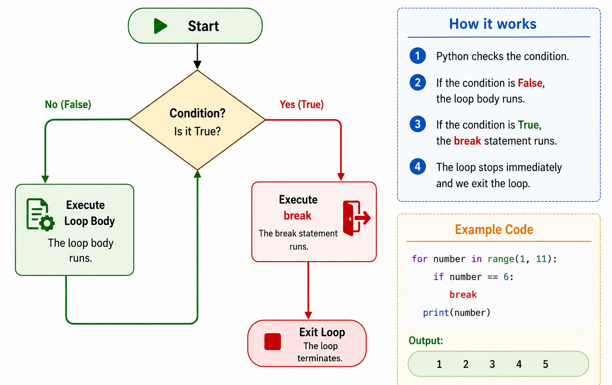
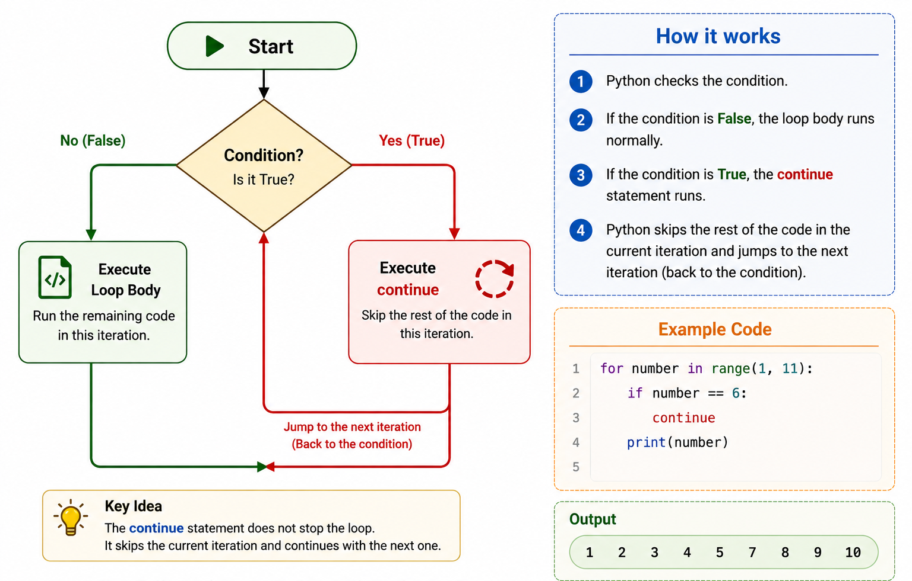

# بخش ۱ — حلقه ها چیستند؟ (`Loops`)


> 🌐 language: **فارسی** | [English](../README.md)


در برنامه نویسی، خیلی وقت ها نیاز داریم یک کار مشابه را چندین بار انجام دهیم.

نوشتن یک کد تکراری به صورت دستی روش مناسبی نیست.

حلقه ها به ما اجازه می دهند یک بخش از کد را به صورت خودکار چندین بار اجرا کنیم.

---

## چرا به حلقه ها نیاز داریم؟

تصور کنید می خواهید یک پیام را پنج بار چاپ کنید.

بدون استفاده از حلقه:

```python
print("Hello")
print("Hello")
print("Hello")
print("Hello")
print("Hello")
```

این کد کار می کند، اما باعث تکرار غیرضروری می شود.

اگر نیاز داشته باشیم یک کار را ۱۰۰ یا ۱۰۰۰ بار انجام دهیم، نوشتن دستی کد بسیار سخت می شود.

حلقه ها این مشکل را حل می کنند.

---

## حلقه چیست؟

حلقه یک ساختار برنامه نویسی است که یک بخش از کد را تا زمانی که یک شرط برقرار باشد یا برای تعداد مشخصی از دفعات تکرار می کند.

هر حلقه سه بخش اصلی دارد:

1. نقطه شروع
2. شرط یا قانون تکرار
3. کدی که باید تکرار شود

---

## حلقه ها چگونه کار می کنند؟

روند کلی یک حلقه:

```
شروع

    بررسی شرط

        اگر شرط درست بود:
            اجرای کد

        تکرار فرآیند

    اگر شرط نادرست بود:
        توقف

پایان
```

برنامه دستورات را تا زمانی که حلقه تمام شود، تکرار می کند.

---

## مثال روزمره

یک ساعت زنگ دار روزانه را تصور کنید.

هر روز:

1. زمان فعلی بررسی می شود.
2. اگر زمان زنگ باشد، هشدار اجرا می شود.
3. تا روز بعد صبر می کند.
4. این فرآیند دوباره تکرار می شود.

این فرآیند شبیه عملکرد حلقه ها در برنامه نویسی است.

---

## اولین نگاه به حلقه ها

یک مثال ساده از حلقه:

```python
for i in range(5):
    print("Hello")
```

خروجی:

```text
Hello
Hello
Hello
Hello
Hello
```

در بخش های بعدی یاد می گیریم `for` و `range()` چگونه کار می کنند.

---

# بخش ۲ — حلقه `while`

## حلقه `while` چیست؟

حلقه `while` یک بخش از کد را تا زمانی که یک شرط برابر با `True` باشد، تکرار می کند.

حلقه تا زمانی ادامه پیدا می کند که شرط به `False` تبدیل شود.

---

## ساختار کلی

```python
while condition:
    statement
```

پایتون قبل از هر بار تکرار، شرط را بررسی می کند.

- اگر شرط `True` باشد، کد داخل حلقه اجرا می شود.
- اگر شرط `False` باشد، حلقه متوقف می شود.

---

## مثال

```python
count = 1

while count <= 5:
    print(count)
    count = count + 1
```

خروجی:

```text
1
2
3
4
5
```

---

## این کد چگونه کار می کند؟

در ابتدا مقدار متغیر برابر است با:

```python
count = 1
```

پایتون شرط زیر را بررسی می کند:

```python
count <= 5
```

نتیجه:

```text
True
```

بنابراین کد داخل حلقه اجرا می شود.

بعد از چاپ مقدار، متغیر افزایش پیدا می کند:

```python
count = count + 1
```

مقدار تغییر می کند:

```text
1 → 2 → 3 → 4 → 5 → 6
```

وقتی مقدار `count` به `6` برسد، شرط تبدیل می شود به:

```text
False
```

و حلقه متوقف می شود.

---

## مثال روزمره

پر کردن یک مخزن آب را تصور کنید.

مراحل:

1. سطح آب بررسی می شود.
2. اگر مخزن پر نباشد، آب بیشتری اضافه می شود.
3. دوباره سطح آب بررسی می شود.
4. این فرآیند تا پر شدن مخزن تکرار می شود.

این فرآیند شبیه عملکرد حلقه `while` در برنامه نویسی است.

---

## نکته مهم

در حلقه `while` باید مطمئن شویم که شرط در نهایت به `False` تبدیل می شود.

اگر مقدار شرط هیچ وقت تغییر نکند، حلقه برای همیشه ادامه پیدا می کند.

مثال:

```python
while True:
    print("Running...")
```

به این حالت **حلقه بی نهایت** یا `Infinite Loop` گفته می شود.

---

# بخش ۳ — حلقه `for`

## حلقه `for` چیست؟

حلقه `for` برای تکرار یک بخش از کد به تعداد مشخص یا پیمایش روی مجموعه ای از مقادیر استفاده می شود.

بر خلاف حلقه `while`، در حلقه `for` معمولاً تعداد تکرارها از قبل مشخص است.

---

## ساختار کلی

```python
for variable in sequence:
    statement
```

پایتون هر مقدار موجود در یک مجموعه را دریافت می کند و کد داخل حلقه را برای هر مقدار یک بار اجرا می کند.

---

## مثال ساده

```python
for number in range(5):
    print(number)
```

خروجی:

```text
0
1
2
3
4
```

حلقه پنج بار اجرا می شود.

---

## این کد چگونه کار می کند؟

تابع `range(5)` یک دنباله از اعداد ایجاد می کند:

```text
0, 1, 2, 3, 4
```

در هر تکرار:

ابتدا:

```python
number = 0
```

سپس:

```python
number = 1
```

بعد:

```python
number = 2
```

این فرآیند تا استفاده از تمام مقادیر ادامه پیدا می کند.

---

## پیمایش روی یک لیست

حلقه `for` می تواند روی اعضای یک لیست هم حرکت کند.

مثال:

```python
names = ["Ali", "Sara", "John"]

for name in names:
    print(name)
```

خروجی:

```text
Ali
Sara
John
```

حلقه هر آیتم لیست را دریافت می کند و کد را اجرا می کند.

---

## تفاوت حلقه `for` و `while`

| حلقه `for` | حلقه `while` |
|---|---|
| زمانی استفاده می شود که تعداد تکرار مشخص است | زمانی استفاده می شود که تکرار به یک شرط وابسته است |
| معمولاً با مجموعه ها کار می کند | با شرط ها کار می کند |
| معمولاً به صورت خودکار متوقف می شود | نیاز دارد شرط به `False` تبدیل شود |

مثال:

وقتی تعداد تکرار مشخص است:

```python
for i in range(10):
    print(i)
```

وقتی منتظر برقرار شدن یک شرط هستیم:

```python
while password != "1234":
    print("Try again")
```

---

## نکته مهم

در حلقه `for` نیازی نیست مقدار شمارنده را دستی تغییر دهیم.

پایتون به صورت خودکار به مقدار بعدی در دنباله می رود.

---

# بخش ۴ — تابع `range()`

## `range()` چیست؟

تابع `range()` برای ایجاد یک دنباله از اعداد استفاده می شود.

این تابع معمولاً همراه با حلقه `for` استفاده می شود، زمانی که نیاز داریم یک کد را تعداد مشخصی از دفعات اجرا کنیم.

---

## ساختار کلی

```python
range(stop)
```

دنباله از عدد `0` شروع می شود و قبل از مقدار مشخص شده متوقف می شود.

مثال:

```python
for number in range(5):
    print(number)
```

خروجی:

```text
0
1
2
3
4
```

توجه کنید که عدد `5` در خروجی وجود ندارد.

---

## استفاده از `range()` با شروع و پایان

می توانیم مشخص کنیم دنباله از کجا شروع شود و کجا پایان پیدا کند.

ساختار:

```python
range(start, stop)
```

مثال:

```python
for number in range(2, 6):
    print(number)
```

خروجی:

```text
2
3
4
5
```

مقدار شروع شامل می شود، اما مقدار پایان شامل نمی شود.

---

## استفاده از `range()` با گام

می توانیم فاصله بین اعداد را هم مشخص کنیم.

ساختار:

```python
range(start, stop, step)
```

مثال:

```python
for number in range(0, 10, 2):
    print(number)
```

خروجی:

```text
0
2
4
6
8
```

مقدار `step` مشخص می کند عدد در هر تکرار چقدر تغییر کند.

---

## شمارش به صورت معکوس

مقدار `step` می تواند منفی باشد.

مثال:

```python
for number in range(5, 0, -1):
    print(number)
```

خروجی:

```text
5
4
3
2
1
```

---

## اشتباه رایج

یکی از اشتباهات رایج این است که فراموش کنیم مقدار پایان در `range()` شامل نمی شود.

مثال:

```python
range(1, 5)
```

ایجاد می کند:

```text
1, 2, 3, 4
```

نه:

```text
1, 2, 3, 4, 5
```

---

## خلاصه

تابع `range()` سه شکل اصلی دارد:

```python
range(stop)

range(start, stop)

range(start, stop, step)
```

این تابع یکی از مهم ترین ابزارها هنگام کار با حلقه های `for` است.

---

# بخش ۵ — حلقه های تو در تو (`Nested Loops`)

گاهی اوقات یک حلقه به تنهایی کافی نیست.

در بعضی از برنامه ها لازم است یک حلقه داخل حلقه دیگری اجرا شود.

به این حالت **حلقه های تو در تو (Nested Loops)** گفته می شود.

به زبان ساده:

> یک حلقه داخل حلقه دیگر اجرا می شود.

---

## یک مثال روزمره

فرض کنید در یک مدرسه چند کلاس وجود دارد.

در هر کلاس نیز چند دانش آموز حضور دارند.

اگر بخواهید نام تمام دانش آموزان را بررسی کنید، باید:

1. وارد کلاس اول شوید.
2. تمام دانش آموزان آن کلاس را بررسی کنید.
3. سپس به کلاس بعدی بروید.
4. همین روند را تکرار کنید.

حلقه های تو در تو نیز دقیقاً به همین شکل کار می کنند.

حلقه بیرونی بین کلاس ها حرکت می کند.

حلقه داخلی تمام دانش آموزان هر کلاس را بررسی می کند.

---

## ساختار کلی

```python
for item1 in sequence1:
    for item2 in sequence2:
        statement
```

حلقه داخلی ابتدا به طور کامل اجرا می شود.

سپس حلقه بیرونی وارد تکرار بعدی می شود.

---

## مثال

```python
for row in range(3):
    for column in range(3):
        print(row, column)
```

خروجی:

```text
0 0
0 1
0 2
1 0
1 1
1 2
2 0
2 1
2 2
```

برای هر مقدار `row`، حلقه داخلی تمام مقدار های `column` را اجرا می کند.

---

## نکته مهم

حلقه بیرونی تعیین می کند حلقه داخلی چند بار اجرا شود.

حلقه داخلی همیشه به طور کامل تمام می شود و سپس حلقه بیرونی وارد تکرار بعدی می شود.

---

# بخش ۶ — دستور `break`

به طور معمول، یک حلقه تا زمانی ادامه پیدا می کند که تمام تکرار های آن انجام شود.

اما گاهی اوقات می خواهیم قبل از پایان حلقه، اجرای آن را متوقف کنیم.

پایتون برای این کار دستور `break` را در اختیار ما قرار داده است.

کلمه **break** یعنی:

> «همین حالا از حلقه خارج شو.»

---

## یک مثال روزمره

فرض کنید به دنبال یک کتاب داخل کتابخانه هستید.

کتاب ها را یکی یکی بررسی می کنید.

به محض اینکه کتاب مورد نظر خود را پیدا کنید، دیگر نیازی نیست بقیه کتاب ها را بررسی کنید.

در همان لحظه جستجو را متوقف می کنید.

دستور `break` نیز دقیقاً همین کار را انجام می دهد.

---

## ساختار کلی

```python
for item in sequence:
    if condition:
        break
```

به محض اینکه پایتون به دستور `break` برسد، اجرای حلقه متوقف می شود.

---

## مثال

```python
for number in range(1, 11):
    if number == 6:
        break

    print(number)
```

خروجی:

```text
1
2
3
4
5
```

وقتی مقدار `number` برابر `6` می شود، حلقه بلافاصله متوقف می شود.

به همین دلیل اعداد بعد از 5 هرگز پردازش نمی شوند.

---

## یک مثال دیگر

```python
while True:
    password = input("Enter the password: ")

    if password == "python":
        print("Access granted.")
        break
```

این حلقه تا زمانی ادامه پیدا می کند که کاربر رمز صحیح را وارد کند.

---

## نکته مهم

دستور `break` فقط حلقه ای را متوقف می کند که داخل آن قرار گرفته است.

اگر داخل یک حلقه تو در تو باشد، فقط همان حلقه داخلی متوقف خواهد شد.

---

<p align="center">
  
</p>

<p align="center">
  <em>شکل ۱. خروج فوری از حلقه پس از اجرای دستور <code>break</code>.</em>
</p>

---

# بخش ۷ — دستور `continue`

در بخش قبل یاد گرفتید که دستور `break` اجرای حلقه را به طور کامل متوقف می کند.

اما گاهی اوقات نمی خواهیم حلقه متوقف شود.

فقط می خواهیم از تکرار فعلی عبور کنیم و وارد تکرار بعدی شویم.

پایتون برای این کار از دستور `continue` استفاده می کند.

کلمه **continue** یعنی:

> «از این تکرار عبور کن و تکرار بعدی را ادامه بده.»

---

## یک مثال روزمره

فرض کنید یک معلم در حال بررسی تکالیف دانش آموزان است.

یکی از دانش آموزان غایب است.

معلم بررسی تکالیف را متوقف نمی کند.

فقط از آن دانش آموز عبور می کند و سراغ دانش آموز بعدی می رود.

دستور `continue` نیز دقیقاً همین کار را انجام می دهد.

---

## ساختار کلی

```python
for item in sequence:
    if condition:
        continue

    statement
```

به محض اینکه پایتون به دستور `continue` برسد، بقیه کد های همان تکرار را نادیده می گیرد و مستقیماً وارد تکرار بعدی می شود.

---

## مثال

```python
for number in range(1, 11):

    if number == 6:
        continue

    print(number)
```

خروجی:

```text
1
2
3
4
5
7
8
9
10
```

عدد `6` نمایش داده نمی شود، اما حلقه همچنان ادامه پیدا می کند.

---

## یک مثال دیگر

```python
for letter in "PYTHON":

    if letter == "H":
        continue

    print(letter)
```

خروجی:

```text
P
Y
T
O
N
```

پایتون حرف `H` را نادیده می گیرد و بقیه حروف را چاپ می کند.

---

## نکته مهم

برخلاف `break`، دستور `continue` حلقه را متوقف نمی کند.

فقط از همان تکرار فعلی عبور می کند.

---

<p align="center">
  
</p>

<p align="center">
  <em>شکل ۲. عبور از تکرار فعلی و ادامه اجرای حلقه با دستور <code>continue</code>.</em>
</p>

---

# بخش ۸ — مقایسه `break` و `continue`

هر دو دستور `break` و `continue` داخل حلقه ها استفاده می شوند.

اما رفتار آن ها با یکدیگر متفاوت است.

---

## دستور `break`

دستور `break` کل حلقه را بلافاصله متوقف می کند.

بعد از اجرای آن، پایتون از حلقه خارج می شود و اجرای برنامه را از اولین دستور بعد از حلقه ادامه می دهد.

مثال:

```python
for number in range(1, 6):
    if number == 3:
        break

    print(number)
```

خروجی:

```text
1
2
```

---

## دستور `continue`

دستور `continue` حلقه را متوقف نمی کند.

فقط از همان تکرار فعلی عبور می کند و وارد تکرار بعدی می شود.

مثال:

```python
for number in range(1, 6):
    if number == 3:
        continue

    print(number)
```

خروجی:

```text
1
2
4
5
```

---

## جدول مقایسه

| دستور | عملکرد |
|-------|---------|
| `break` | اجرای کل حلقه را متوقف می کند. |
| `continue` | فقط از تکرار فعلی عبور می کند و حلقه را ادامه می دهد. |

---

## نکته مهم

اگر می خواهید اجرای حلقه به طور کامل متوقف شود، از `break` استفاده کنید.

اگر فقط می خواهید یک تکرار نادیده گرفته شود، از `continue` استفاده کنید.

---

# بخش ۹ — تمرین ها (`Try It Yourself`)

حالا نوبت شماست.

تمرین های زیر به شما کمک می کنند تمام مطالب این درس را مرور و تمرین کنید.

سعی کنید قبل از دیدن پاسخ، هر تمرین را خودتان حل کنید.

هر چه بیشتر تمرین کنید، درک شما از حلقه ها عمیق تر خواهد شد.

---

## تمرین ۱ — چاپ اعداد

با استفاده از حلقه `for`، اعداد ۱ تا ۱۰ را چاپ کنید.

---

## تمرین ۲ — چاپ اعداد به صورت معکوس

با استفاده از حلقه `for`، اعداد ۱۰ تا ۱ را به صورت نزولی چاپ کنید.

---

## تمرین ۳ — مجموع اعداد

مجموع اعداد ۱ تا ۱۰۰ را محاسبه و چاپ کنید.

---

## تمرین ۴ — اعداد زوج

تمام اعداد زوج بین ۱ تا ۵۰ را چاپ کنید.

---

## تمرین ۵ — استفاده از `break`

اعداد ۱ تا ۱۰ را چاپ کنید.

زمانی که به عدد ۷ رسیدید، حلقه را متوقف کنید.

---

## تمرین ۶ — استفاده از `continue`

اعداد ۱ تا ۱۰ را چاپ کنید.

عدد ۵ نباید چاپ شود.

---

## تمرین ۷ — جدول ضرب

با استفاده از حلقه های تو در تو، جدول ضرب ۱ تا ۵ را چاپ کنید.

---

## تمرین ۸ — رسم مربع

با استفاده از حلقه های تو در تو، خروجی زیر را چاپ کنید.

```text
*****
*****
*****
*****
*****
```

---

## تمرین ۹ — شمارش کاراکترها

رشته زیر را در نظر بگیرید.

```python
text = "Python Programming"
```

تعداد کاراکترهای این رشته را محاسبه و چاپ کنید.

---

## تمرین ۱۰ — رسم مثلث

با استفاده از حلقه های تو در تو، خروجی زیر را چاپ کنید.

```text
*
**
***
****
*****
```
---

# بخش ۱۰ — پروژه کوچک (`Mini Project`)

## بازی حدس عدد

در این پروژه، یک بازی ساده طراحی می کنیم.

برنامه یک عدد مخفی در اختیار دارد.

کاربر باید آن قدر عدد وارد کند تا عدد صحیح را پیدا کند.

در این پروژه از چند مفهوم مهمی که در این درس یاد گرفتید استفاده می شود:

- حلقه `while`
- دستور `if`
- دستور `break`
- دریافت ورودی از کاربر
- عملگرهای مقایسه ای

---

## کد پروژه

```python
secret_number = 7

while True:

    guess = int(input("Enter your guess: "))

    if guess == secret_number:
        print("Congratulations! You guessed correctly.")
        break

    print("Wrong guess. Try again.")
```

---

## نمونه اجرا

```text
Enter your guess: 3
Wrong guess. Try again.

Enter your guess: 10
Wrong guess. Try again.

Enter your guess: 7
Congratulations! You guessed correctly.
```

---

## چالش

حالا نوبت شماست که این برنامه را بهتر کنید.

آیا می توانید:

- تعداد تلاش های کاربر را بشمارید؟
- اگر عدد کوچک تر بود، پیام **"عدد بزرگ تر است"** نمایش دهید؟
- اگر عدد بزرگ تر بود، پیام **"عدد کوچک تر است"** نمایش دهید؟
- بعد از برنده شدن، امکان شروع یک بازی جدید را اضافه کنید؟

---

