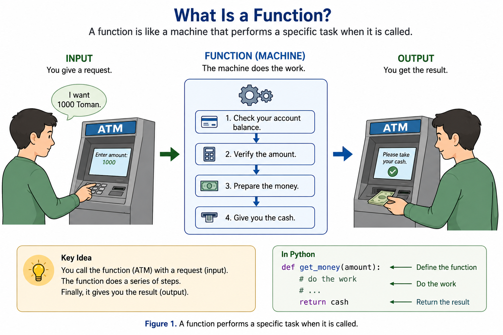
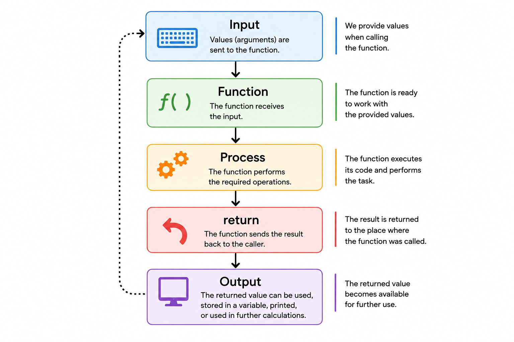

# بخش ۱ — تابع چیست؟ (`What Is a Function?`)

> 🌐 language: **فارسی** | [English](../README.md)

هر چه برنامه ها بزرگ تر می شوند، نوشتن تمام کد ها در یک محل سخت تر می شود.

گاهی بخشی از کد چندین بار یک کار یکسان را انجام می دهد.

به جای اینکه همان کد را بارها و بارها بنویسیم، می توانیم آن را داخل یک **تابع (Function)** قرار دهیم.

تابع، بخشی از کد است که یک وظیفه مشخص را انجام می دهد و هر زمان که لازم باشد، می توان دوباره از آن استفاده کرد.

---

## یک مثال روزمره

فرض کنید یک دستگاه قهوه ساز دارید.

فقط دکمه **Coffee** را فشار می دهید.

دستگاه به صورت خودکار کارهای زیر را انجام می دهد:

- آب را گرم می کند.
- دانه های قهوه را آسیاب می کند.
- قهوه را آماده می کند.
- آن را داخل فنجان می ریزد.

شما فقط یک دکمه را فشار داده اید.

نیازی نیست تمام این مراحل را خودتان انجام دهید.

تابع در پایتون نیز دقیقاً به همین شکل کار می کند.

شما فقط تابع را صدا می زنید و پایتون تمام دستور های داخل آن را اجرا می کند.

---

## چرا از تابع استفاده می کنیم؟

تابع ها به ما کمک می کنند:

- از تکرار کد جلوگیری کنیم.
- خواندن برنامه ساده تر شود.
- برنامه را به بخش های کوچک تر تقسیم کنیم.
- نگهداری و توسعه برنامه راحت تر شود.

---

## یک مثال ساده

```python
def say_hello():
    print("Hello!")
```

در این مرحله هنوز هیچ اتفاقی نمی افتد.

ما فقط تابع را تعریف کرده ایم.

برای اجرای آن باید تابع را فراخوانی کنیم.

```python
say_hello()
```

خروجی:

```text
Hello!
```

---

## نکته مهم

تعریف کردن تابع و فراخوانی تابع دو مفهوم متفاوت هستند.

در زمان تعریف، مشخص می کنیم تابع چه کاری انجام دهد.

در زمان فراخوانی، از پایتون می خواهیم آن وظیفه را اجرا کند.

---

<p align="center">
  
</p>

<p align="center">
  <em>شکل ۱. یک تابع مانند یک دستگاه است که با دریافت یک درخواست، مجموعه ای از کارهای مشخص را انجام می دهد.</em>
</p>

---

# بخش ۲ — تعریف تابع (`def`)

در پایتون، تعریف هر تابع با کلمه کلیدی `def` آغاز می شود.

کلمه `def` مخفف **define** است و به معنی **تعریف کردن** می باشد.

هر زمان پایتون این کلمه را ببیند، متوجه می شود که قرار است یک تابع جدید تعریف شود.

---

## ساختار کلی

```python
def function_name():
    # function body
```

هر تابع از دو بخش اصلی تشکیل شده است.

- **سرآیند تابع (Function Header)** → خطی که با `def` شروع می شود.
- **بدنه تابع (Function Body)** → کد هایی که هنگام فراخوانی تابع اجرا می شوند.

---

## اولین تابع

```python
def say_hello():
    print("Hello!")
```

این کد فقط تابع را **تعریف** می کند.

هنوز هیچ اتفاقی نمی افتد.

برای اجرای تابع باید آن را **فراخوانی** کنیم.

```python
say_hello()
```

خروجی:

```text
Hello!
```

---

## یک مثال دیگر

```python
def welcome():
    print("Welcome to Python!")
```

فراخوانی تابع:

```python
welcome()
```

خروجی:

```text
Welcome to Python!
```

---

## نکته مهم

تعریف کردن تابع به معنی اجرای آن نیست.

تابع فقط زمانی اجرا می شود که آن را فراخوانی کنیم.

---

# بخش ۳ — پارامترها (`Parameters`)

یک تابع می تواند اطلاعاتی را از بیرون دریافت کند.

این اطلاعات باعث می شوند تابع هر بار با مقدار های مختلف کار کند.

متغیر هایی که داخل تعریف تابع برای دریافت این اطلاعات استفاده می شوند، **پارامتر (Parameter)** نام دارند.

---

## یک مثال روزمره

فرض کنید یک دستگاه خودپرداز دارید.

خود دستگاه همیشه یکسان است.

اما مقدار پولی که هر شخص درخواست می کند می تواند متفاوت باشد.

یک نفر ممکن است درخواست کند:

```
100 تومان
```

شخص دیگری ممکن است درخواست کند:

```
500 تومان
```

دستگاه خودپرداز از مقدار وارد شده استفاده می کند و عملیات را انجام می دهد.

در پایتون، پارامترها نیز دقیقاً همین نقش را دارند.

آن ها به تابع اجازه می دهند مقدار های مختلفی دریافت کند.

---

## ساختار کلی

```python
def function_name(parameter):
    # function body
```

پارامتر یک متغیر است که هنگام فراخوانی تابع، مقدار دریافت می کند.

---

## مثال

```python
def greet(name):
    print("Hello", name)
```

در اینجا تابع یک پارامتر به نام `name` دارد.

حالا می توانیم مقدار های مختلفی به آن بدهیم:

```python
greet("Ahmad")
```

خروجی:

```text
Hello Ahmad
```

فراخوانی دیگر:

```python
greet("Sara")
```

خروجی:

```text
Hello Sara
```

---

## چند پارامتر

یک تابع می تواند بیشتر از یک پارامتر داشته باشد.

مثال:

```python
def introduce(name, age):
    print(name)
    print(age)
```

فراخوانی تابع:

```python
introduce("Ahmad", 36)
```

خروجی:

```text
Ahmad
36
```

---

## نکته مهم

پارامترها هنگام تعریف تابع ایجاد می شوند.

مقدار واقعی آن ها هنگام فراخوانی تابع ارسال می شود.

در بخش بعد، درباره این مقدار ها صحبت می کنیم: **آرگومان ها (`Arguments`)**.

---

# بخش ۴ — آرگومان ها (`Arguments`)

در بخش قبل با **پارامترها (`Parameters`)** آشنا شدید.

حالا باید با یک مفهوم مهم دیگر آشنا شویم: **آرگومان ها (`Arguments`)**.

پارامتر و آرگومان به یکدیگر مرتبط هستند، اما یکسان نیستند.

---

## آرگومان چیست؟

**آرگومان (`Argument`)** مقداری است که هنگام فراخوانی تابع به آن ارسال می کنیم.

برای مثال:

```python
def greet(name):
    print("Hello", name)
```

در اینجا `name` یک **پارامتر** است.

حالا تابع را فراخوانی می کنیم:

```python
greet("Ahmad")
```

در اینجا `"Ahmad"` یک **آرگومان** است.

---

## تفاوت پارامتر و آرگومان

می توانیم این موضوع را این طور در نظر بگیریم:

```python
def greet(name):
```

`name` یک جای خالی است.

یعنی تابع می گوید:

> «قرار است یک مقدار در این قسمت دریافت کنم.»

اما وقتی می نویسیم:

```python
greet("Ahmad")
```

مقدار واقعی را به تابع می دهیم.

بنابراین:

| مفهوم     | معنی                                                    |
| --------- | ------------------------------------------------------- |
| Parameter | متغیری که هنگام تعریف تابع مشخص می کنیم.                |
| Argument  | مقدار واقعی که هنگام فراخوانی تابع به آن ارسال می کنیم. |

---

## چند آرگومان

یک تابع می تواند چند آرگومان دریافت کند.

```python
def introduce(name, age):
    print("Name:", name)
    print("Age:", age)
```

حالا می توانیم تابع را این طور فراخوانی کنیم:

```python
introduce("Ahmad", 36)
```

خروجی:

```text
Name: Ahmad
Age: 36
```

در این مثال:

* `name` یک پارامتر است.
* `age` یک پارامتر است.
* `"Ahmad"` یک آرگومان است.
* `36` یک آرگومان است.

---

## یک روش ساده برای به خاطر سپردن

می توانید پارامتر را مانند یک **جعبه خالی** در نظر بگیرید.

آرگومان همان **مقداری است که داخل جعبه قرار می دهیم**.

```text
Parameter → جعبه خالی
Argument  → مقداری که داخل جعبه قرار می گیرد
```

این تفاوت زمانی اهمیت بیشتری پیدا می کند که با تابع هایی دارای پارامترهای متعدد کار کنید.

---

# بخش ۵ — دستور `return`

تا اینجا تابع هایی که نوشتیم، کارهایی مثل نمایش پیام روی صفحه انجام می دادند.

اما گاهی می خواهیم یک تابع **محاسبه ای انجام دهد و نتیجه را به ما برگرداند**.

اینجاست که دستور `return` اهمیت پیدا می کند.

---

## `return` چه کاری انجام می دهد؟

دستور `return` یک مقدار را از داخل تابع به محلی که تابع در آن فراخوانی شده است برمی گرداند.

برای مثال:

```python
def add(a, b):
    return a + b
```

حالا تابع را فراخوانی می کنیم:

```python
result = add(5, 3)
```

تابع محاسبه می کند:

```text
5 + 3 = 8
```

و مقدار `8` را برمی گرداند.

سپس این مقدار داخل متغیر `result` قرار می گیرد.

```python
print(result)
```

خروجی:

```text
8
```

---

## تفاوت `print()` و `return`

یکی از مهم ترین نکاتی که باید یاد بگیرید، تفاوت `print()` و `return` است.

این تابع را در نظر بگیرید:

```python
def add(a, b):
    print(a + b)
```

وقتی آن را این طور فراخوانی می کنیم:

```python
result = add(5, 3)
```

تابع مقدار زیر را روی صفحه نمایش می دهد:

```text
8
```

اما متغیر `result` شامل مقدار `8` نیست.

حالا نسخه دوم را ببینید:

```python
def add(a, b):
    return a + b
```

وقتی می نویسیم:

```python
result = add(5, 3)
```

این بار مقدار `8` داخل `result` قرار می گیرد.

بنابراین:

| `print()`                                   | `return`                                                     |
| ------------------------------------------- | ------------------------------------------------------------ |
| یک مقدار را روی صفحه نمایش می دهد.          | یک مقدار را از تابع برمی گرداند.                             |
| بیشتر برای نمایش اطلاعات استفاده می شود.    | زمانی استفاده می شود که بخواهیم نتیجه را بعداً استفاده کنیم. |
| مقدار نمایش داده شده را به ما برنمی گرداند. | مقدار را به محل فراخوانی تابع برمی گرداند.                   |

---

## یک مثال روزمره

فرض کنید از یک ماشین حساب استفاده می کنید.

شما وارد می کنید:

```text
36 + 14
```

ماشین حساب محاسبه را انجام می دهد و نتیجه را به شما می دهد:

```text
50
```

حالا می توانید از این نتیجه در یک محاسبه دیگر استفاده کنید:

```text
50 × 2 = 100
```

تابعی که از `return` استفاده می کند نیز تقریباً همین کار را انجام می دهد.

تابع یک عملیات را انجام می دهد و **نتیجه را برمی گرداند** تا بتوانیم از آن در بخش دیگری از برنامه استفاده کنیم.

---

## استفاده از مقدار بازگشتی

مقداری که تابع برمی گرداند، لزوماً نباید همان لحظه چاپ شود.

می توانیم آن را داخل یک متغیر ذخیره کنیم:

```python
def multiply(a, b):
    return a * b

result = multiply(6, 4)

print(result)
```

خروجی:

```text
24
```

همچنین می توانیم مقدار بازگشتی را مستقیماً چاپ کنیم:

```python
print(multiply(6, 4))
```

خروجی:

```text
24
```

یا از آن در یک محاسبه دیگر استفاده کنیم:

```python
result = multiply(6, 4)

final_result = result + 10

print(final_result)
```

خروجی:

```text
34
```

---

## `return` اجرای تابع را متوقف می کند

وقتی پایتون به دستور `return` می رسد، اجرای تابع بلافاصله متوقف می شود.

برای مثال:

```python
def test():
    print("Start")
    return
    print("End")
```

حالا تابع را فراخوانی می کنیم:

```python
test()
```

خروجی:

```text
Start
```

پیام `"End"` هرگز چاپ نمی شود، چون تابع به محض رسیدن به `return` متوقف شده است.

---

## برگرداندن چند مقدار

یک تابع می تواند بیشتر از یک مقدار را نیز برگرداند.

برای مثال:

```python
def calculate(a, b):
    return a + b, a * b
```

می توانیم هر دو نتیجه را دریافت کنیم:

```python
sum_result, multiply_result = calculate(5, 3)
```

حالا:

```python
print(sum_result)
print(multiply_result)
```

خروجی:

```text
8
15
```

---

## نکته مهم

این قانون ساده را به خاطر بسپارید:

> `print()` یک مقدار را نمایش می دهد.
<br />

> `return` یک مقدار را از تابع برمی گرداند.

این تفاوت بسیار مهم است، چون مقدار بازگشتی را می توانیم ذخیره کنیم، دوباره استفاده کنیم، با مقدار دیگری مقایسه کنیم یا در محاسبات دیگر به کار ببریم.

<p align="center">
  
</p>

<p align="center">
  <em>شکل ۲. جریان دریافت ورودی، اجرای تابع و برگرداندن نتیجه با دستور <code>return</code>.</em>
</p>

---

# بخش ۶ — متغیرهای محلی و سراسری

متغیرها می توانند در بخش های مختلف برنامه ایجاد شوند.

بسته به اینکه یک متغیر کجا ایجاد شده باشد، ممکن است فقط داخل یک تابع در دسترس باشد یا بتوان از آن در بخش های مختلف برنامه استفاده کرد.

به طور معمول، متغیرها در این زمینه به دو نوع تقسیم می شوند:

* **متغیر محلی (`Local Variable`)**
* **متغیر سراسری (`Global Variable`)**

---

## متغیرهای محلی

متغیری که داخل یک تابع ایجاد شود، **متغیر محلی (`Local Variable`)** نام دارد.

یک متغیر محلی معمولاً فقط داخل همان تابع قابل استفاده است.

برای مثال:

```python
def greet():
    name = "Ahmad"
    print(name)

greet()
```

خروجی:

```text
Ahmad
```

در اینجا `name` یک متغیر محلی است، چون داخل تابع `greet()` ایجاد شده است.

نمی توانیم به طور معمول از آن خارج از تابع استفاده کنیم:

```python
def greet():
    name = "Ahmad"

greet()

print(name)
```

این کد با خطا مواجه می شود، چون `name` فقط داخل تابع وجود دارد.

---

## متغیرهای سراسری

متغیری که خارج از یک تابع ایجاد شود، **متغیر سراسری (`Global Variable`)** نام دارد.

یک متغیر سراسری می تواند از بخش های مختلف برنامه، از جمله داخل تابع ها، قابل دسترسی باشد.

برای مثال:

```python
name = "Ahmad"

def greet():
    print(name)

greet()
```

خروجی:

```text
Ahmad
```

در اینجا `name` یک متغیر سراسری است، چون خارج از تابع ایجاد شده است.

---

## تفاوت متغیر محلی و سراسری

مثال زیر را در نظر بگیرید:

```python
name = "Ahmad"

def greet():
    message = "Hello"
    print(name)
    print(message)

greet()
```

در این مثال:

* `name` یک متغیر سراسری است.
* `message` یک متغیر محلی است.

تابع می تواند به متغیر سراسری `name` دسترسی داشته باشد.

اما `message` فقط داخل تابع `greet()` وجود دارد.

---

## متغیرهایی با نام یکسان

یک متغیر محلی می تواند همان نام یک متغیر سراسری را داشته باشد.

برای مثال:

```python
name = "Ahmad"

def greet():
    name = "Sara"
    print(name)

greet()

print(name)
```

خروجی:

```text
Sara
Ahmad
```

چرا؟

چون `name` داخل تابع یک متغیر محلی است.

این متغیر، `name` سراسری را تغییر نمی دهد.

---

## تغییر متغیر سراسری

اگر بخواهیم مقدار یک متغیر سراسری را از داخل یک تابع تغییر دهیم، پایتون کلمه کلیدی `global` را در اختیار ما قرار می دهد.

برای مثال:

```python
age = 36

def change_age():
    global age
    age = 40

change_age()

print(age)
```

خروجی:

```text
40
```

کلمه کلیدی `global` به پایتون می گوید که می خواهیم از همان متغیر سراسری استفاده کنیم، نه اینکه یک متغیر محلی جدید ایجاد کنیم.

---

## نکته مهم

اگرچه کلمه کلیدی `global` در بعضی شرایط کاربرد دارد، تغییر دادن متغیرهای سراسری از داخل تابع می تواند درک و نگهداری برنامه را سخت تر کند.

در بیشتر مواقع بهتر است مقدارها را با استفاده از **پارامترها** وارد تابع کنیم و نتیجه را با استفاده از **`return`** دریافت کنیم.

برای مثال:

```python
def increase_age(age):
    return age + 1

age = 36

age = increase_age(age)

print(age)
```

خروجی:

```text
37
```

این روش باعث می شود تابع مستقل تر و استفاده مجدد از آن ساده تر باشد.

---

## یک قانون ساده برای به خاطر سپردن

> **متغیر محلی:** داخل یک تابع ایجاد می شود و معمولاً فقط همان جا قابل استفاده است.

> **متغیر سراسری:** خارج از یک تابع ایجاد می شود و می تواند از بخش های مختلف برنامه قابل دسترسی باشد.

تا حد امکان، به جای استفاده زیاد از متغیرهای سراسری، از **پارامترها** و **`return`** استفاده کنید.

---

# بخش ۷ — مسئله الگوریتمی

## محاسبه تعداد سال های باقی مانده تا ۴۰ سالگی

حالا می خواهیم تمام چیزهایی را که تا اینجا یاد گرفته ایم، در یک مسئله کوچک کنار هم قرار دهیم.

می خواهیم برنامه ای بنویسیم که سن کاربر را دریافت کند و مشخص کند چند سال دیگر به سن ۴۰ سالگی می رسد.

برنامه باید برای انجام این محاسبه از یک تابع استفاده کند و نتیجه را با `return` برگرداند.

---

## مسئله

برنامه ای بنویسید که:

1. سن کاربر را دریافت کند.
2. سن را به یک تابع ارسال کند.
3. تابع مشخص کند چند سال تا رسیدن به سن ۴۰ باقی مانده است.
4. تابع نتیجه را با `return` برگرداند.
5. برنامه نتیجه را نمایش دهد.

برای مثال، اگر سن کاربر `36` باشد:

```text
You have 4 years until you reach 40.
```

---

## الگوریتم

قبل از نوشتن کد، ابتدا مسئله را مرحله به مرحله حل می کنیم.

```text
شروع
  ↓
دریافت سن کاربر
  ↓
فراخوانی تابع
  ↓
محاسبه 40 - age
  ↓
برگرداندن نتیجه
  ↓
ذخیره مقدار بازگشتی
  ↓
نمایش نتیجه
  ↓
پایان
```

---

## الگوریتم مرحله به مرحله

### مرحله ۱ — دریافت سن

ابتدا سن کاربر را دریافت می کنیم.

```python
age = int(input("Enter your age: "))
```

---

### مرحله ۲ — تعریف تابع

تابع را تعریف می کنیم و سن را به عنوان پارامتر دریافت می کنیم.

```python
def years_until_40(age):
```

---

### مرحله ۳ — محاسبه نتیجه

سن کاربر را از `40` کم می کنیم.

```python
def years_until_40(age):
    return 40 - age
```

---

### مرحله ۴ — فراخوانی تابع

حالا تابع را فراخوانی می کنیم و سن کاربر را به عنوان آرگومان به آن می دهیم.

```python
result = years_until_40(age)
```

در اینجا:

* `age` داخل تعریف تابع یک **پارامتر** است.
* `age` هنگام فراخوانی تابع یک **آرگومان** است.
* تابع نتیجه محاسبه را با `return` برمی گرداند.

---

### مرحله ۵ — نمایش نتیجه

در نهایت نتیجه را نمایش می دهیم.

```python
print("You have", result, "years until you reach 40.")
```

---

## برنامه کامل

```python
age = int(input("Enter your age: "))


def years_until_40(age):
    return 40 - age


result = years_until_40(age)

print("You have", result, "years until you reach 40.")
```

---

## نمونه اجرا

```text
Enter your age: 36
You have 4 years until you reach 40.
```

---

## از چه چیزهایی استفاده کردیم؟

در همین مسئله کوچک، چند مفهوم مختلف را با هم ترکیب کردیم:

* متغیرها
* `input()`
* تبدیل نوع با `int()`
* تابع ها
* پارامترها
* آرگومان ها
* `return`
* متغیرهای داخل و خارج تابع
* محاسبات ساده

نکته مهم همین جاست: **تفکر الگوریتمی**.

ما کار را با نوشتن کد شروع نکردیم.

ابتدا مسئله را فهمیدیم، آن را به چند مرحله کوچک تقسیم کردیم، الگوریتم را نوشتیم و سپس الگوریتم را به کد پایتون تبدیل کردیم.

---

## قبل از نوشتن کد فکر کنید

هر زمان با یک مسئله جدید روبه رو شدید، از خودتان بپرسید:

1. چه اطلاعاتی در اختیار دارم؟
2. چه اطلاعاتی نیاز دارم؟
3. برنامه باید چه چیزی را محاسبه کند؟
4. برای رسیدن به نتیجه چه مراحلی لازم است؟
5. کدام قسمت های مسئله بهتر است به تابع تبدیل شوند؟

هر چه برنامه ها بزرگ تر شوند، این نوع تفکر اهمیت بیشتری پیدا می کند.

---

# بخش ۸ — تمرین ها

## تمرین ۱ — نمایش سلام

تابعی به نام `say_hello` بنویسید که پیام زیر را نمایش دهد:

```text
Hello, Python!
```

سپس تابع را فراخوانی کنید تا نتیجه را ببینید.

---

## تمرین ۲ — سلام کردن به کاربر

تابعی به نام `greet` بنویسید که نام یک شخص را به عنوان پارامتر دریافت کند و پیام زیر را نمایش دهد:

```text
Hello, Ahmad!
```

برای مثال:

```python
greet("Ahmad")
```

---

## تمرین ۳ — جمع دو عدد

تابعی به نام `add` بنویسید که دو عدد را دریافت کند و مجموع آن ها را با `return` برگرداند.

مثال:

```python
result = add(10, 5)

print(result)
```

خروجی مورد انتظار:

```text
15
```

---

## تمرین ۴ — محاسبه مربع

تابعی به نام `square` بنویسید که یک عدد را دریافت کند و مربع آن را برگرداند.

مثال:

```python
result = square(6)

print(result)
```

خروجی مورد انتظار:

```text
36
```

---

## تمرین ۵ — بررسی سن

تابعی به نام `is_adult` بنویسید که سن یک شخص را دریافت کند و موارد زیر را برگرداند:

* اگر سن ۱۸ سال یا بیشتر بود، `True`
* در غیر این صورت، `False`

مثال:

```python
print(is_adult(20))
print(is_adult(15))
```

خروجی مورد انتظار:

```text
True
False
```

---

## تمرین ۶ — محاسبه سال های باقی مانده

تابعی به نام `years_until_40` بنویسید که سن یک شخص را دریافت کند و مشخص کند چند سال تا رسیدن به سن ۴۰ باقی مانده است.

مثال:

```python
result = years_until_40(36)

print(result)
```

خروجی مورد انتظار:

```text
4
```

---

## تمرین ۷ — پیدا کردن عدد بزرگ تر

تابعی به نام `find_larger` بنویسید که دو عدد را دریافت کند و عدد بزرگ تر را برگرداند.

مثال:

```python
result = find_larger(15, 9)

print(result)
```

خروجی مورد انتظار:

```text
15
```

تابع را با عدد های مختلف نیز آزمایش کنید.

---

## تمرین ۸ — محاسبه میانگین

تابعی به نام `average` بنویسید که سه عدد را دریافت کند و میانگین آن ها را برگرداند.

مثال:

```python
result = average(10, 20, 30)

print(result)
```

خروجی مورد انتظار:

```text
20.0
```

---

## تمرین ۹ — شمارش معکوس

تابعی به نام `count_down` بنویسید که یک عدد صحیح مثبت دریافت کند و با استفاده از حلقه `for`، عدد ها را از آن عدد تا `1` نمایش دهد.

مثال:

```python
count_down(5)
```

خروجی مورد انتظار:

```text
5
4
3
2
1
```

---

## تمرین ۱۰ — تابع ماشین حساب ساده

تابعی به نام `calculate` بنویسید که موارد زیر را دریافت کند:

* دو عدد
* یک عملگر

تابع باید بر اساس عملگر، عملیات مورد نظر را انجام دهد و نتیجه را با `return` برگرداند.

عملگر های زیر را پشتیبانی کنید:

```text
+
-
*
/
```

برای مثال:

```python
result = calculate(10, 5, "+")

print(result)
```

خروجی مورد انتظار:

```text
15
```

سایر عملگر ها را نیز امتحان کنید.

### چالش

اگر کاربر بخواهد عددی را بر `0` تقسیم کند، تابع باید چه کاری انجام دهد؟

سعی کنید این حالت را به شکل ایمن مدیریت کنید.

---

## قبل از شروع

فوراً سراغ نوشتن کد نروید.

برای هر تمرین:

1. مسئله را به دقت متوجه شوید.
2. ورودی ها را مشخص کنید.
3. خروجی مورد انتظار را مشخص کنید.
4. مسئله را به چند مرحله کوچک تر تقسیم کنید.
5. الگوریتم را بنویسید.
6. سپس کد پایتون را بنویسید.

هدف فقط این نیست که کد کار کند.

هدف این است که یاد بگیرید **چطور مانند یک برنامه نویس فکر کنید**.
